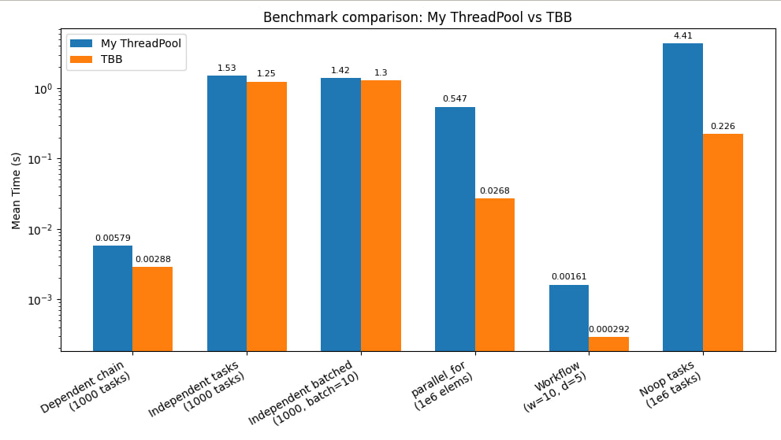
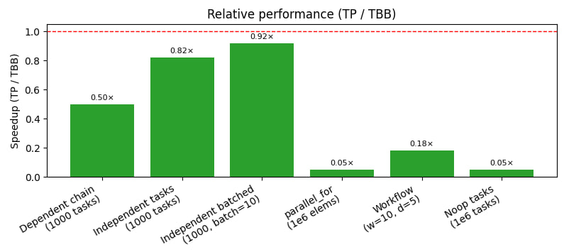
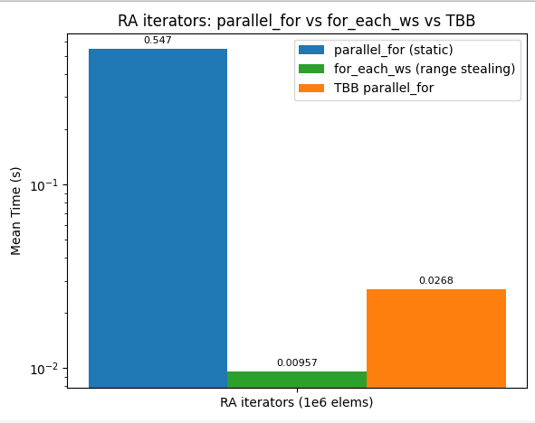

# DagFlow

[](https://cmake.org/)
[](LICENSE)
[](https://github.com/cpp20120/DagFlow).

DAG-flow runtime.

A self-contained, minimal runtime for parallel task execution in C++20.  
Designed for workloads where you know the dependency graph in advance, need predictable scheduling, and want full control over affinity, priorities, and back-pressure — without the complexity of a full TBB.

Mini-runtime for parallel tasks in C++20:

* Work-stealing pool (Chase–Lev deques, central ring-buffer MPMC queues).

* Bounded ring-buffer MPMC (Vyukov) for central queues — zero per-operation heap allocations.

* Per-worker task free-list for allocation-free task recycling on the hot path.

* A local `small_function` for cheap closures with inline storage.

* A lightweight DAG graph with cancellation, concurrency limits, and back-pressure.

* High-level API in the spirit of TBB: `submit`/`then`/`when_all`/`parallel_for` via `TaskScope`.

### [Design](https://github.com/cpp20120/DagFlow/blob/main/docs/how_it_works.md)
* Scheduler: local deques (Chase–Lev) + central ring-buffer MPMC shards for external submissions; worker drains own shard first, then steals from neighbours.

* Central queues: Vyukov bounded ring buffer (capacity `DAGFLOW_CENTRAL_QUEUE_CAPACITY = 16 384`) — no node allocation per push, no QSBR reclamation needed.

* Token tracking: atomic CAS-decrement on `Node::queued` counter — replaces the old per-node MS-queue inbox entirely.

* Notifications: cold-start nudge (`inflight == 0`) + periodic fan-out every 64 / 128 external submissions. Pool-thread dispatches nudge one sleeping neighbour when `inflight < W/2`.

* Synchronization: `memory_order` (acquire/release/seq_cst where reconciliation is required).

By default, `small_function<void(), 128>` in graph nodes. If you get a "Callable too large" error, increase `DAGFLOW_TASK_FN_SIZE` in `config.hpp` or pack captures into a `shared_ptr` block.

For "heavy" stages, set `concurrency > 1` in `ScheduleOptions`/`NodeOptions`.

Configure `Config` for CPU/NUMA; `pin_threads = true` is useful for cache stability.

In large pipelines, enable back-pressure via `capacity` + `Overflow` at bottleneck nodes.

### Benchmarks
```
CPU:    AMD Ryzen 7 6800H
OS:     Linux 6.19 (CachyOS)
Build:  Release (-O3 -march=native)
Compiler: Clang 19
Config: pin_threads = true
```

| Benchmark                               | Runs | Mean       | Min        | Max        |
|-----------------------------------------|------|------------|------------|------------|
| **Dependent chain (1 000 tasks)**       | 5    | 0.430 ms   | 0.312 ms   | 0.732 ms   |
| **Independent tasks (1 000)**           | 5    | 2.238 s    | 2.229 s    | 2.247 s    |
| **Independent batched (1 000, b=10)**   | 5    | 2.333 s    | 2.284 s    | 2.367 s    |
| **Parallel_for (1 000 000 elements)**   | 5    | 11.5 ms    | 9.8 ms     | 13.1 ms    |
| **Workflow (width=10, depth=5)**        | 5    | 143 µs     | 59 µs      | 207 µs     |
| **Noop tasks (1 000 000)**              | 5    | 0.606 s    | 0.554 s    | 0.682 s    |

\* Numbers vary with CPU governor, background load, and NUMA topology.

For each versions

| For each version                    | Runs | Mean      | Min       | Max       | Notes                        |
|-------------------------------------|------|-----------|-----------|-----------|------------------------------|
| **for\_each (static chunking)**     | 5    | 9.4 ms    | 9.0 ms    | 9.8 ms    | baseline                     |
| **for\_each\_ws (range stealing)**  | 5    | 9.5 ms    | 9.0 ms    | 10.2 ms   | adaptive; better on skew     |

**for_each_ws (range stealing)** — Lazy binary range partitioning with help-first stealing of upper halves.  
Distributes load better for uneven workloads and reduces tail latency. Requires random-access iterators.

Compare with [TBB](https://github.com/uxlfoundation/oneTBB)

| Benchmark           | Problem size    | DagFlow mean | TBB mean   | DagFlow throughput  |
|---------------------|-----------------|--------------|------------|---------------------|
| Dependent chain     | 1 000 tasks     | 0.430 ms     | 0.288 ms   | ~2.3 M tasks/s      |
| Independent tasks   | 1 000 tasks     | 2.238 s      | 1.251 s    | ~447 tasks/s        |
| parallel_for        | 1 000 000 elems | 11.5 ms      | 26.8 ms    | ~87 M elems/s       |
| for_each_ws         | 1 000 000 elems | 9.5 ms       | 26.8 ms    | ~105 M elems/s      |
| Workflow (w=10,d=5) | ~50 stage ops   | 143 µs       | 292 µs     | —                   |
| Noop tasks          | 1 000 000 tasks | 0.606 s      | 0.226 s    | ~1.65 M tasks/s     |

### Visualization





### Build and usage

```sh
git clone https://github.com/cpp20120/DagFlow.git
cd DagFlow
cmake -B build -DTp_BUILD_EXAMPLES=ON
cmake --build build --config Release
```

How to use in your CMake project

1. Via `add_subdirectory`:
```cmake
add_subdirectory(external/DagFlow)

add_executable(my_app main.cpp)
target_link_libraries(my_app PRIVATE DagFlow)
```

2. Via `find_package`:
```cmake
find_package(DagFlow REQUIRED)

add_executable(my_app main.cpp)
target_link_libraries(my_app PRIVATE DagFlow::DagFlow)
```

`find_package` works after `cmake --install`.

2.5 On Windows, add to your target:
```cmake
if (WIN32 AND TP_BUILD_SHARED)
  add_custom_command(TARGET ${CMAKE_PROJECT_NAME} POST_BUILD
    COMMAND ${CMAKE_COMMAND} -E copy_if_different
      $<TARGET_FILE:DagFlow>
      $<TARGET_FILE_DIR:my_app>
  )
endif()
```

### Example of usage: [there](https://github.com/cpp20120/DagFlow/blob/main/src/main.cpp)

Minimal example
```cpp
#include <dagflow.hpp>

dagflow::Pool pool;
dagflow::TaskScope scope(pool);

auto a = scope.submit([] { /* … */ });
auto b = scope.then(a, [] { /* … */ });
auto c = scope.when_all({a, b}, [] { /* … */ });

scope.run_and_wait();
```
