# DagFlow: current lifetime, ownership, custody, and completion model

> **Status:** historical snapshot, not the current runtime contract. In particular,
> inline overflow and stop-only destruction below have been replaced by
> [shared overflow and graceful shutdown](pool-lifecycle.md). For current credits,
> graph storage and TaskScope semantics see [how it works](how_it_works.md).  
> **Scope:** `Pool`, workers, scheduler queues, `ScheduledTask`, task allocator, `Handle::Counter`, `TaskGraph`, `RunState`, nodes, lanes, tokens, cancellation, `TaskScope`, and user-owned captures/ranges.  
> **Not a redesign:** this document first describes what the code does now and the invariants on which that behavior relies. Design changes can be derived from this model later.


## Navigation

- [Core model: ownership, custody, liveness](#2-the-three-axis-model)
- [Pool, workers, and destruction](#5-pool-lifetime-and-destruction)
- [ScheduledTask and scheduler queues](#6-scheduledtask-physical-scheduler-packet)
- [Allocator lifetime](#13-task-allocator-storage-ownership-model)
- [Handle / Counter liveness](#18-handle-completion-ownership-not-task-ownership)
- [Graph definition, RunState, nodes, lanes, and tokens](#24-static-graph-definition-versus-per-run-state)
- [Cancellation, errors, and TaskScope](#42-cancellation-model)
- [Memory ordering](#51-memory-ordering-relationships-relevant-to-lifetime)
- [Full invariant catalog](#55-global-invariant-catalog)
- [Contract holes and sharp edges](#57-current-contract-holes-and-sharp-edges)
- [Canonical full-model diagram](#63-canonical-invariant-diagram)

---

The most important observation is that DagFlow currently has **three orthogonal lifetime dimensions**. A large part of the runtime becomes much easier to reason about once they are kept separate:

1. **Storage ownership** — who owns the memory containing an object and when that storage may be reclaimed/reused.
2. **Execution custody** — which runtime component currently has the exclusive right to schedule, transfer, or execute a unit of work.
3. **Liveness/completion ownership** — which outstanding credits prevent a logical operation from becoming complete.

A queue may have custody of a task without owning its storage. A `Handle` may keep completion state alive without keeping the task alive. A graph execution path may keep the graph run alive without owning the graph definition. These are deliberately different relationships.

---

## 1. Source-of-truth and terminology

The current source of truth is the implementation in:

- `include/dagflow/thread_pool.hpp`
- `src/thread_pool.cpp`
- `src/scheduler.hpp`
- `src/scheduler.cpp`
- `src/task_allocator.hpp`
- `include/dagflow/handle.hpp`
- `include/dagflow/task_graph.hpp`
- `src/task_graph.cpp`
- `include/dagflow/task_scope.hpp`
- `include/dagflow/detail/chase_lev_deque.hpp`
- `include/dagflow/detail/ring_mpmc.hpp`

`docs/how_it_works.md` describes an older execution model in several places. In particular, the current implementation is **reusable across runs**, and a successor becomes ready after the **last lane of the predecessor node** finishes, not after an individual token completes.

The supplied snapshot builds successfully and its current test suite passes 7/7 tests.

### 1.1 Terms used in this document

| Term | Meaning in this document |
|---|---|
| **definition** | Persistent graph structure: `TaskGraph::Node` objects and compiled `edges_`. |
| **run** | One invocation of `TaskGraph::run()`, represented by one `RunState`. |
| **scheduler packet** | One `detail::ScheduledTask` accepted by the pool/scheduler. |
| **lane** | One logical executor path assigned to a graph node. A lane can execute many tokens and can be handed off without ending. |
| **token** | A logical indexed invocation of a graph node's callable. It has no separately allocated runtime object. |
| **custody** | Exclusive right to act on a scheduler packet or logical lane. Custody is not storage ownership. |
| **credit** | One unit in a completion counter that must eventually be discharged exactly once. |
| **quiescence** | State in which no execution can still access the object being destroyed or structurally mutated. |
| **publication** | Transfer that makes work visible to another execution context, normally via a scheduler queue. |
| **bypass** | Continuing the current graph execution path directly into a compatible successor without creating a new scheduler packet for that final lane. |

---

# 2. The three-axis model

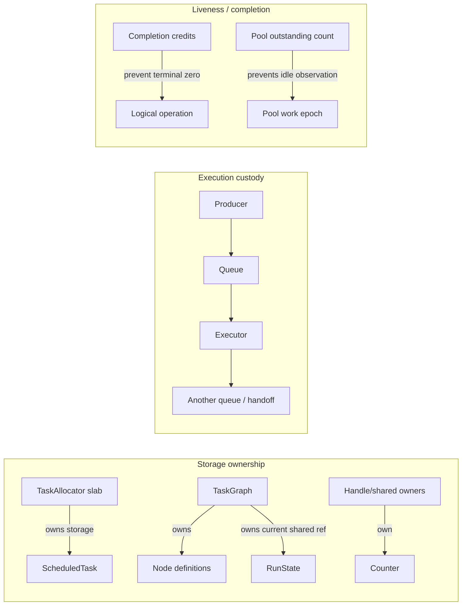
```mermaid
flowchart LR
    subgraph Storage["Storage ownership"]
        A[TaskAllocator slab] -->|owns storage| ST[ScheduledTask]
        TG[TaskGraph] -->|owns| N[Node definitions]
        TG -->|owns current shared ref| RS[RunState]
        H[Handle/shared owners] -->|own| C[Counter]
    end

    subgraph Custody["Execution custody"]
        P[Producer] --> Q[Queue]
        Q --> X[Executor]
        X --> Q2[Another queue / handoff]
    end

    subgraph Liveness["Liveness / completion"]
        CR[Completion credits] -->|prevent terminal zero| OP[Logical operation]
        OUT[Pool outstanding count] -->|prevents idle observation| POOLRUN[Pool work epoch]
    end
```

These axes are related, but no one axis substitutes for another.

### 2.1 Storage ownership answers

- Who may reclaim this memory?
- Who guarantees that a raw pointer still points to a constructed object?
- When can the same slot be reused for a different task?
- What object owns persistent graph callables?

### 2.2 Execution custody answers

- Who is allowed to execute this task now?
- After a successful push, may the producer still touch the task?
- After a successful steal, does the victim still own the stolen pointer?
- During graph yield, who owns the logical lane?

### 2.3 Liveness ownership answers

- Why can an operation not reach completion while it is still publishing children?
- What prevents graph destruction while a path can still access `nodes_`?
- Why can a `ScheduledTask` be recycled before its `Handle` object is destroyed?
- Why is queue emptiness not a completion condition?

---

# 3. Runtime object taxonomy

There is no single object named “task” that covers the entire system.

| Runtime entity | Persistent? | Storage owner | May move through queues? | Completion role |
|---|---:|---|---:|---|
| `ScheduledTask` | No, reused | `TaskAllocator` slab | Yes, as raw pointer | Optional per-packet `Counter`; always `Pool::outstanding_` |
| `TaskGraph::Node` | Yes, across runs | `TaskGraph::nodes_` | No | Definition only |
| `TaskGraph::NodeState` | Per run | `RunState::runtime` | No | Tracks predecessor count, token claiming, lane count |
| graph lane | Logical only | No independent storage | Indirectly; represented by execution paths/packets | One live graph execution path owns a graph completion credit |
| graph token | Logical index only | No independent storage | No | No independent completion credit |
| `RunState` | Per run | `shared_ptr` owners | Captured by graph packets | Owns run-local state and graph completion counter |
| `Handle::Counter` | Until last shared owner | `shared_ptr` owners | No | Completion state itself |
| `JobHandle` / `NodeId` | Value only | Caller value | No | None; identity/index only |

A particularly important separation is:

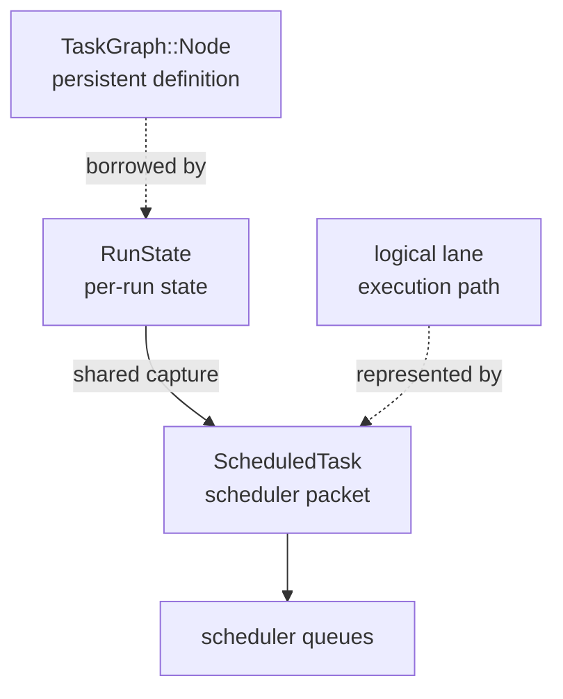
```mermaid
flowchart TD
    N["TaskGraph::Node\npersistent definition"]
    RS["RunState\nper-run state"]
    L["logical lane\nexecution path"]
    ST["ScheduledTask\nscheduler packet"]
    Q["scheduler queues"]

    N -. borrowed by .-> RS
    RS -->|shared capture| ST
    L -. represented by .-> ST
    ST --> Q
```

A graph node itself never becomes a `ScheduledTask`. The scheduler sees wrapper packets containing a closure such as `execute(state, node_index)`.

---

# 4. Top-level lifetime hierarchy

The intended outer lifetime relationship is:

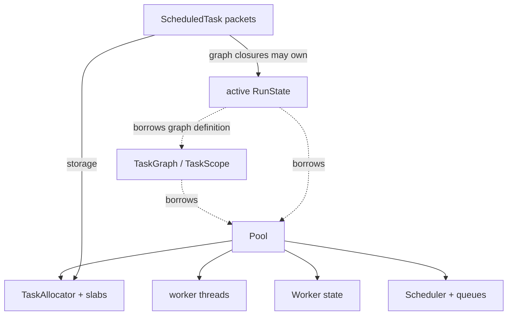
```mermaid
flowchart TD
    Pool["Pool"]
    Threads["worker threads"]
    Workers["Worker state"]
    Sched["Scheduler + queues"]
    Alloc["TaskAllocator + slabs"]
    Graph["TaskGraph / TaskScope"]
    Run["active RunState"]
    Packets["ScheduledTask packets"]

    Pool --> Threads
    Pool --> Workers
    Pool --> Sched
    Pool --> Alloc

    Graph -. borrows .-> Pool
    Run -. borrows .-> Pool
    Run -. borrows graph definition .-> Graph
    Packets -->|storage| Alloc
    Packets -->|graph closures may own| Run
```

The implementation relies on an external contract:

> **The `Pool` must outlive every `TaskGraph`/`TaskScope` bound to it and every submitted operation that can still require the pool.**

`Pool::~Pool()` does **not** perform a drain-to-idle protocol. It sets `stop_`, wakes workers, and joins them. Workers exit their loop when they next observe `stop_`. Therefore queued packets may remain unexecuted if the pool is destroyed while work is still outstanding.

This is not merely a performance detail. It is a lifetime precondition.

---

# 5. `Pool` lifetime and destruction

## 5.1 Construction

Construction creates, in this order conceptually:

1. scheduler and its fixed-capacity queues,
2. task allocator and shards,
3. per-worker state,
4. worker threads.

Each worker installs:

- `tls_pool_ = this`
- `tls_id_ = worker id`

for the duration of `worker_loop()`.

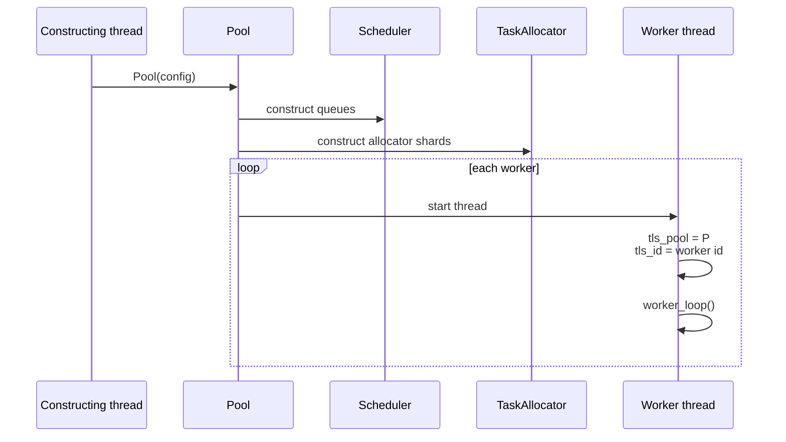
```mermaid
sequenceDiagram
    participant U as Constructing thread
    participant P as Pool
    participant S as Scheduler
    participant A as TaskAllocator
    participant W as Worker thread

    U->>P: Pool(config)
    P->>S: construct queues
    P->>A: construct allocator shards
    loop each worker
        P->>W: start thread
        W->>W: tls_pool = P<br/>tls_id = worker id
        W->>W: worker_loop()
    end
```

## 5.2 Worker state lifetime

A worker thread may access:

- its `Worker` object,
- the scheduler,
- the allocator,
- other workers' sleeping/wake state,
- the pool's stop/outstanding atomics.

Therefore all of those objects must remain alive until after worker join.

### Invariant P-01 — worker backing state

> While a worker thread can execute `worker_loop`, `Worker`, `Scheduler`, `TaskAllocator`, and the containing `Pool` storage remain alive.

The destructor satisfies this by joining threads in the destructor body before member destruction occurs.

## 5.3 Destruction is stop-and-join, not drain

Current destructor behavior:

```text
stop_ = true
notify all workers
join all worker threads
member destruction follows
```

Worker loop condition:

```text
while (!stop_) {
    try_help_one(...)
    ...
}
```

A worker already inside a callable finishes that `execute_task()` before returning to the loop condition. A queued packet, however, need not be acquired before exit.

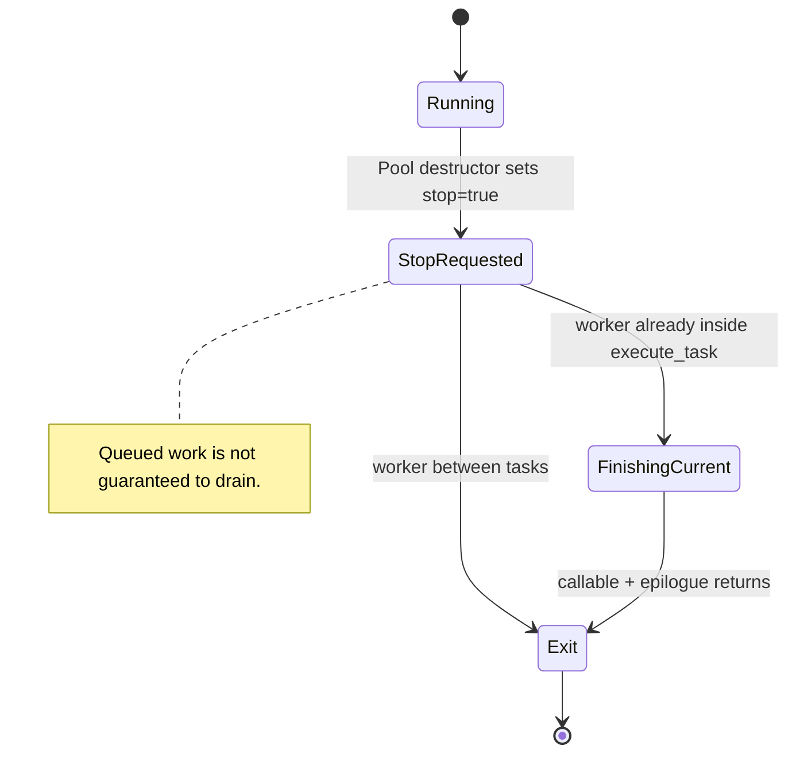
```mermaid
stateDiagram-v2
    [*] --> Running
    Running --> StopRequested: Pool destructor sets stop=true
    StopRequested --> FinishingCurrent: worker already inside execute_task
    StopRequested --> Exit: worker between tasks
    FinishingCurrent --> Exit: callable + epilogue returns
    Exit --> [*]

    note right of StopRequested
      Queued work is not guaranteed to drain.
    end note
```

### Invariant P-02 — pool destruction requires quiescence

> Destruction of `Pool` is only valid when no operation can still depend on future pool execution or future submission to that pool.

Consequences of violating this precondition can include:

- queued work never executes,
- per-task completion counters never receive their final `complete()`,
- a still-valid `Handle` may remain permanently nonzero,
- graph execution may be stranded,
- an active callable may submit work after `stop_` was set, leaving that child queued after the worker exits.

A `Handle` may outlive the pool **only after the operation represented by the handle has already completed**. The tests explicitly cover retaining a completed handle after pool destruction.

---

# 6. `ScheduledTask`: physical scheduler packet

The scheduler packet is:

```cpp
struct ScheduledTask {
    small_function<void()> fn;
    Priority prio;
    std::shared_ptr<Handle::Counter> done;
    void* allocation_slot;
};
```

It has four independent roles:

- `fn`: executable closure and its captures,
- `prio`: queue selection metadata,
- `done`: optional completion state for the logical API operation,
- `allocation_slot`: permanent backlink to allocator metadata.

The object is not created and destroyed for each submission. Its enclosing allocator slot remains constructed and is reused.

---

# 7. `ScheduledTask` lifecycle state machine

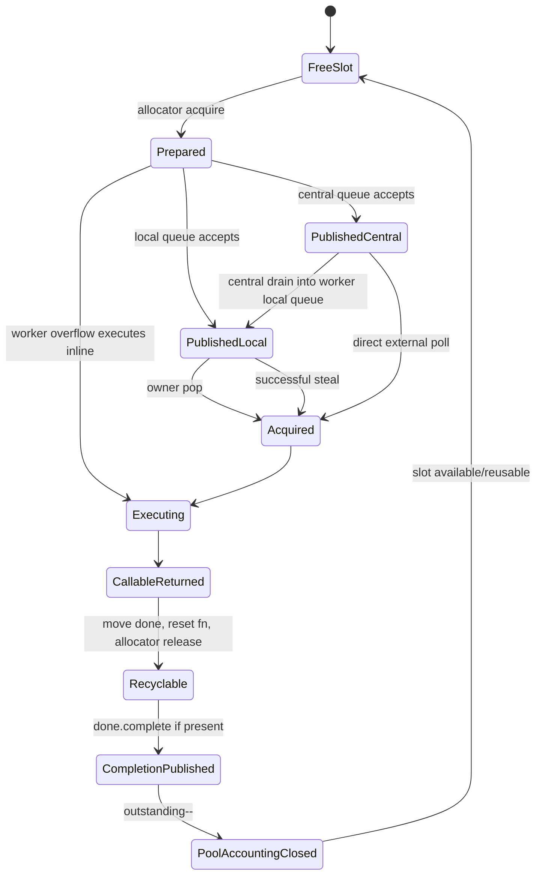
```mermaid
stateDiagram-v2
    [*] --> FreeSlot
    FreeSlot --> Prepared: allocator acquire
    Prepared --> PublishedLocal: local queue accepts
    Prepared --> PublishedCentral: central queue accepts
    Prepared --> Executing: worker overflow executes inline

    PublishedLocal --> Acquired: owner pop
    PublishedLocal --> Acquired: successful steal
    PublishedCentral --> Acquired: direct external poll
    PublishedCentral --> PublishedLocal: central drain into worker local queue

    Acquired --> Executing
    Executing --> CallableReturned
    CallableReturned --> Recyclable: move done, reset fn, allocator release
    Recyclable --> CompletionPublished: done.complete if present
    CompletionPublished --> PoolAccountingClosed: outstanding--
    PoolAccountingClosed --> FreeSlot: slot available/reusable
```

`FreeSlot` here is logical allocator availability, not C++ object destruction.

## 7.1 Preparation order

Submission acquires a slot, then initializes:

1. `fn`,
2. `prio`,
3. `done`,
4. increments `outstanding_`,
5. dispatches the pointer.

`outstanding_` is incremented **before publication**, so a transfer between queues cannot create a false idle window.

### Invariant T-01 — initialize before publication

> A `ScheduledTask` is fully initialized for the new submission before any successful scheduler publication transfers custody to another execution context.

---

# 8. Scheduler custody model

Queues store `ScheduledTask*`, but queue storage does not own the task's memory. Instead, a successful queue operation transfers **custody**.

At any instant a live packet is logically controlled by exactly one of:

- the producer before publication,
- one local Chase–Lev deque,
- one central MPMC queue,
- a transient drain/steal batch held by a worker,
- one executor.

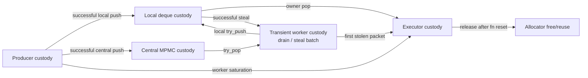
```mermaid
flowchart LR
    PROD["Producer custody"]
    LOCAL["Local deque custody"]
    CENTRAL["Central MPMC custody"]
    TRANSFER["Transient worker custody\ndrain / steal batch"]
    EXEC["Executor custody"]
    FREE["Allocator free/reuse"]

    PROD -->|successful local push| LOCAL
    PROD -->|successful central push| CENTRAL
    PROD -->|worker saturation| EXEC
    CENTRAL -->|try_pop| TRANSFER
    TRANSFER -->|local try_push| LOCAL
    LOCAL -->|owner pop| EXEC
    LOCAL -->|successful steal| TRANSFER
    TRANSFER -->|first stolen packet| EXEC
    EXEC -->|release after fn reset| FREE
```

### Invariant S-01 — single custody

> Every live `ScheduledTask` has exactly one logical custody owner at a time.

### Invariant S-02 — success transfers custody

> After a successful queue `push`, the producer must no longer dereference or execute the packet. After a successful `pop`/`steal`, the queue no longer has logical custody of the packet.

### Invariant S-03 — failure retains custody

> A failed non-mutating queue operation does not transfer custody. In particular, failed `try_push` leaves the caller responsible for the packet.

This is why worker-side saturation can safely fall back to inline execution: the queue rejected the packet, so the worker still owns it.

---

# 9. Local Chase–Lev queue lifetime rules

Each worker has two local deques:

- high priority,
- normal priority.

The worker is the **single owner** of `try_push`, `try_pop`, and `free_capacity`. Other workers may only steal.

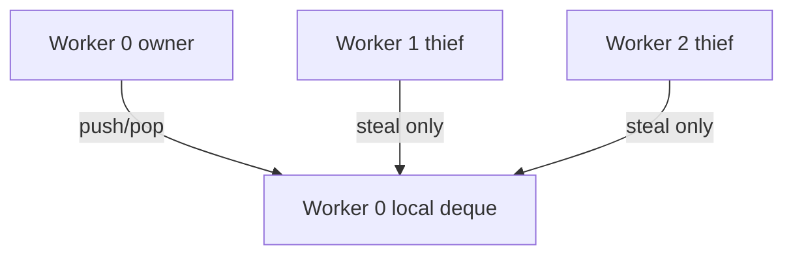
```mermaid
flowchart TD
    W0["Worker 0 owner"] -->|push/pop| D0["Worker 0 local deque"]
    W1["Worker 1 thief"] -->|steal only| D0
    W2["Worker 2 thief"] -->|steal only| D0
```

The queue stores atomic pointer values. After a successful pop/steal, old pointer bits may remain in a ring cell until overwritten. Those bits are **not** an owning reference and do not extend task lifetime.

### Invariant Q-01 — indices define validity

> Queue membership is defined by queue indices/protocol state, not by whether an old ring slot still contains a pointer value.

### Invariant Q-02 — local queue destruction

> A Chase–Lev deque may only be destroyed after its owner and every potential thief have stopped accessing it.

Pool worker join satisfies this only if no external code can access the internal scheduler.

---

# 10. Central MPMC queue lifetime rules

Central queues are fixed-capacity Vyukov-style MPMC rings, again split by priority and sharded.

They support many producers and many consumers. A successful `try_push` publishes custody; a successful `try_pop` acquires custody.

The queue is not strictly lock-free: a producer that reserves a slot and stalls before publishing can temporarily obstruct consumers at the head.

### Invariant Q-03 — reserved slot must complete its protocol

> Once a producer reserves a central ring position, it must publish/recycle that position according to the queue algorithm. This is why the stored type is required to be nothrow-move-assignable.

### Invariant Q-04 — queue emptiness is not liveness

> `empty()` is a snapshot and may not be used as an operation-completion condition.

This applies both to central queues and local deques. Completion is tracked separately by counters.

---

# 11. Submission paths and custody transfer

## 11.1 Worker submission, `Spawn`

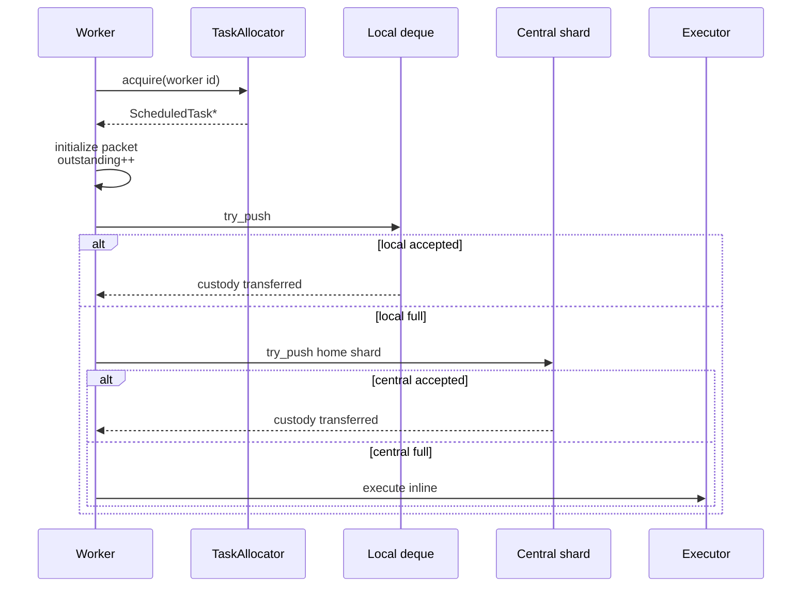
```mermaid
sequenceDiagram
    participant W as Worker
    participant A as TaskAllocator
    participant L as Local deque
    participant C as Central shard
    participant E as Executor

    W->>A: acquire(worker id)
    A-->>W: ScheduledTask*
    W->>W: initialize packet<br/>outstanding++
    W->>L: try_push
    alt local accepted
        L-->>W: custody transferred
    else local full
        W->>C: try_push home shard
        alt central accepted
            C-->>W: custody transferred
        else central full
            W->>E: execute inline
        end
    end
```

Workers never spin waiting for queue capacity. This prevents a worker from blocking while holding an execution resource that queued work may need.

## 11.2 Worker submission, `Enqueue`

A worker using `SubmissionMode::Enqueue` bypasses the local deque and tries the selected central shard directly. If the central queue rejects the packet, the worker executes it inline.

## 11.3 External submission

External producers allocate from an external allocator shard and submit only through a central queue. On saturation they spin/yield until publication succeeds.

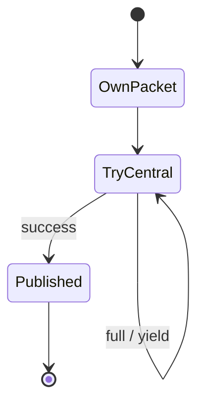
```mermaid
stateDiagram-v2
    [*] --> OwnPacket
    OwnPacket --> TryCentral
    TryCentral --> Published: success
    TryCentral --> TryCentral: full / yield
    Published --> [*]
```

An external producer does **not** execute the packet inline.

### Invariant S-04 — external backpressure preserves custody

> While an external producer retries a full central queue, it retains exclusive custody of the packet.

---

# 12. Drain and steal transfers

## 12.1 Central drain

A worker can pop a batch from a central queue and push it into its own local deque.

For each element:

```text
central owns -> successful pop -> worker transiently owns -> successful local push -> local deque owns
```

The local push is expected to succeed because drain limits the batch by the owner's available local capacity. Failure is treated as an invariant violation and terminates.

## 12.2 Batch steal

Stealing takes up to a small batch. After successful steals:

- `tasks[1..n)` are published into the thief's local queue,
- `tasks[0]` is returned directly for immediate execution.

The rest of the batch is published **before** executing the first packet.

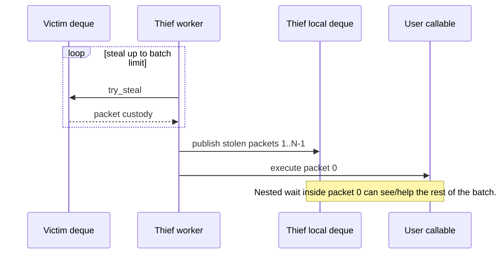
```mermaid
sequenceDiagram
    participant V as Victim deque
    participant T as Thief worker
    participant D as Thief local deque
    participant U as User callable

    loop steal up to batch limit
        T->>V: try_steal
        V-->>T: packet custody
    end
    T->>D: publish stolen packets 1..N-1
    T->>U: execute packet 0
    Note over U,D: Nested wait inside packet 0 can see/help the rest of the batch.
```

### Invariant S-05 — batch visibility before user code

> When a stolen batch yields one immediately executed packet and additional packets, the additional packets become scheduler-visible before user code for the first packet runs.

This prevents nested waits from hiding siblings in an unobservable private batch.

---

# 13. Task allocator: storage ownership model

`TaskAllocator<ScheduledTask, 64>` owns the actual `ScheduledTask` objects.

A block contains fixed slots:

```text
Block
  Slot[0]
    ScheduledTask object
    next
    block backlink
  Slot[1]
  ...
```

The `ScheduledTask` object is constructed with the block and remains constructed until the block is destroyed.

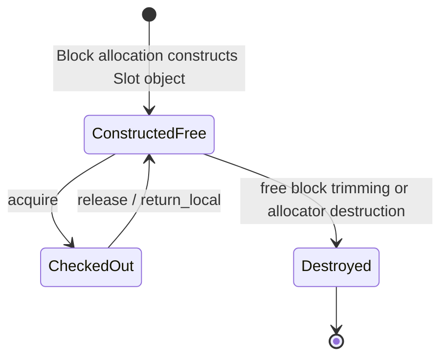
```mermaid
stateDiagram-v2
    [*] --> ConstructedFree: Block allocation constructs Slot object
    ConstructedFree --> CheckedOut: acquire
    CheckedOut --> ConstructedFree: release / return_local
    ConstructedFree --> Destroyed: free block trimming or allocator destruction
    Destroyed --> [*]
```

There is no placement-new/destructor cycle per submitted task.

### Invariant A-01 — slot object remains constructed

> Allocator release means “available for reuse”, not “C++ object lifetime ended”.

Before release, the executor clears task-specific owning state that must not leak into the next use:

- moves out `done`,
- resets `fn`.

`prio` may contain a stale but valid enum value until overwritten on the next acquire. `allocation_slot` remains the permanent backlink.

---

# 14. Allocator shards and ownership

There are:

- one worker shard per worker,
- a bounded number of external shards.

A worker shard has exactly one metadata owner: that worker. An external shard is serialized by `external_mutex`.

Only the shard owner may mutate:

- block free lists,
- available block list,
- `available` counts,
- spare-block count,
- block linkage,
- slab reclamation.

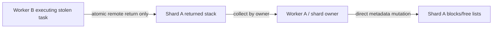
```mermaid
flowchart LR
    WA["Worker A / shard owner"] -->|direct metadata mutation| SA["Shard A blocks/free lists"]
    WB["Worker B executing stolen task"] -->|atomic remote return only| RR["Shard A returned stack"]
    RR -->|collect by owner| WA
```

### Invariant A-02 — single metadata owner

> Slab metadata for a worker shard is mutated only by that shard's owning worker.

### Invariant A-03 — external shard serialization

> Allocation/collection that mutates an external shard is serialized by that shard's `external_mutex`.

---

# 15. Local versus remote task release

After execution, allocator release examines the slot's original shard.

If the packet is executing on its original worker shard:

```text
executor -> return_local -> block free list
```

If it was stolen or originated from an external shard:

```text
executor -> atomic returned stack of origin shard
```

The remote executor must not mutate origin block metadata directly.

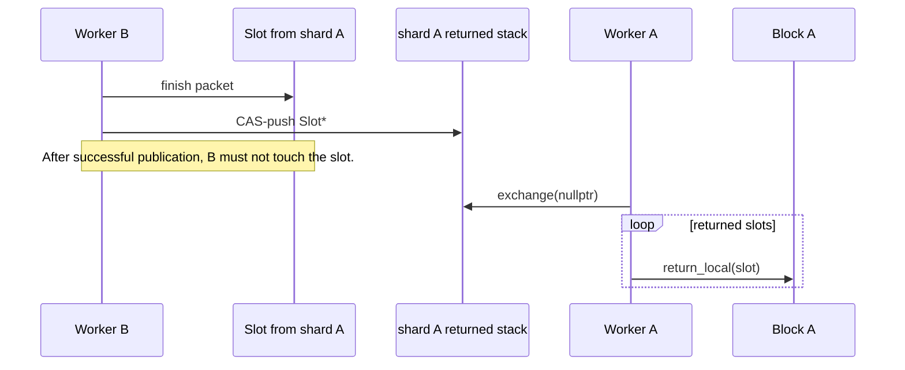
```mermaid
sequenceDiagram
    participant B as Worker B
    participant S as Slot from shard A
    participant R as shard A returned stack
    participant A as Worker A
    participant BL as Block A

    B->>S: finish packet
    B->>R: CAS-push Slot*
    Note over B,S: After successful publication, B must not touch the slot.
    A->>R: exchange(nullptr)
    loop returned slots
        A->>BL: return_local(slot)
    end
```

### Invariant A-04 — no use after remote return publication

> Once a remote return CAS publishes the slot to its origin shard, the releasing worker no longer accesses that slot. The owner may immediately collect it and may even reclaim the containing block if all slots are free.

### Invariant A-05 — block reclaim only under owner authority

> A block can be deleted only by its shard owner (or external-shard lock holder), after all of its slots have returned to that shard's free accounting.

The allocator keeps at most one completely free spare block per shard; additional completely free blocks may be deleted.

---

# 16. Packet execution epilogue and observable completion

Current execution order is semantically important:

```text
invoke t->fn()
catch and record exception into t->done if present
move t->done into local shared_ptr
reset t->fn
allocator.release(t)
if done: done->complete()
outstanding_--
```

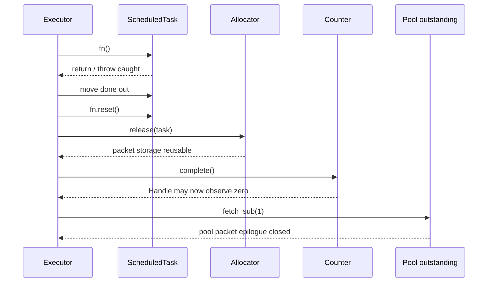
```mermaid
sequenceDiagram
    participant E as Executor
    participant T as ScheduledTask
    participant A as Allocator
    participant C as Counter
    participant O as Pool outstanding

    E->>T: fn()
    T-->>E: return / throw caught
    E->>T: move done out
    E->>T: fn.reset()
    E->>A: release(task)
    A-->>E: packet storage reusable
    E->>C: complete()
    C-->>E: Handle may now observe zero
    E->>O: fetch_sub(1)
    O-->>E: pool packet epilogue closed
```

This gives several distinct completion points:

1. user callable returned,
2. closure/captures in `ScheduledTask::fn` were released,
3. packet storage became reusable,
4. per-operation `Handle::Counter` credit was discharged,
5. pool `outstanding_` accounting was discharged.

They are not the same event.

### Invariant T-02 — recycle before handle completion is legal

> A `ScheduledTask` slot may become reusable before a waiting caller observes its associated completion counter reach zero.

This is safe because a `Handle` points to `Counter`, not to `ScheduledTask`.

### Consequence

There is a small valid interval in which:

```text
per-task Handle counter == 0
Pool::outstanding_ still includes the packet
```

Therefore `wait(handle)` and `wait_idle()` have intentionally different semantics.

---

# 17. `Pool::outstanding_`: pool-level liveness accounting

`outstanding_` counts scheduler packets whose pool epilogue has not completed.

It is incremented before dispatch and decremented only after:

- callable completion,
- callable storage reset,
- allocator release,
- per-packet counter completion.

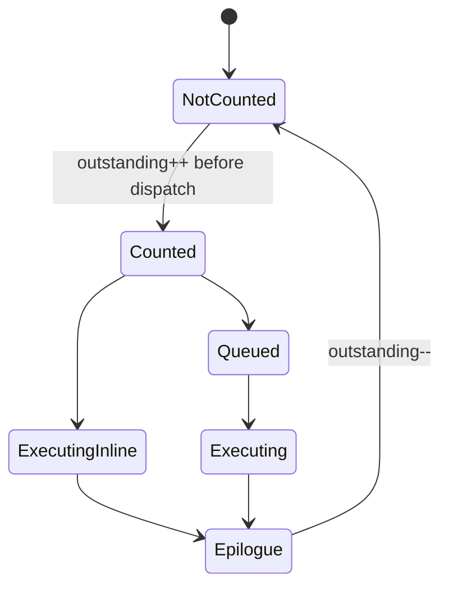
```mermaid
stateDiagram-v2
    [*] --> NotCounted
    NotCounted --> Counted: outstanding++ before dispatch
    Counted --> Queued
    Counted --> ExecutingInline
    Queued --> Executing
    ExecutingInline --> Epilogue
    Executing --> Epilogue
    Epilogue --> NotCounted: outstanding--
```

### Invariant O-01 — accounting spans all scheduler custody transfers

> Once a packet enters pool liveness accounting, moves among local queues, central queues, steal batches, and executors do not change `outstanding_`.

### Invariant O-02 — nested submissions cannot create an internal false-zero

> A running packet remains counted while its callable executes. If that callable submits a child before returning, the child increments `outstanding_` before the parent decrements it.

Thus ordinary in-pool parent/child submission chains cannot make the pool appear idle between parent and child publication.

## 17.1 `wait_idle()` is not a global submission barrier

`wait_idle()` waits until it observes `outstanding_ == 0`. It is external-thread-only.

It does **not** exclude a concurrent producer from submitting immediately after the observed zero.

### Invariant O-03 — idle is an observation, not permanent terminal state

> `outstanding_ == 0` means no currently accounted packet remains at that observation point. It does not make future submissions illegal.

This is different from a specific operation's terminal `Counter == 0`, where the logical operation must never create new credits afterward.

---

# 18. `Handle`: completion ownership, not task ownership

A `Handle` owns only:

```text
shared_ptr<Handle::Counter>
```

It does not own or point to:

- `ScheduledTask`,
- `Pool`,
- worker,
- scheduler queue,
- graph node.

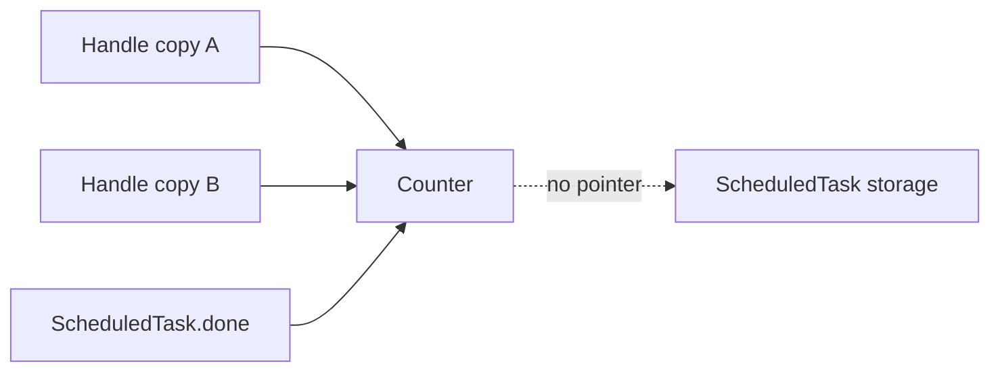
```mermaid
flowchart LR
    H1["Handle copy A"] --> C["Counter"]
    H2["Handle copy B"] --> C
    T["ScheduledTask.done"] --> C
    C -. no pointer .-> X["ScheduledTask storage"]
```

### Invariant H-01 — handle lifetime is counter lifetime

> A valid `Handle` keeps its `Counter` alive, not the work packet that contributed a credit to that counter.

### Invariant H-02 — completed handles may outlive the pool

> Once their operation is complete, handles may safely retain completion/error state after pool destruction because the counter allocation is independent of the pool.

An incomplete handle does not make it safe to destroy the pool; it merely keeps the counter object alive.

---

# 19. Counter credits as the logical liveness primitive

`Counter::count` is best modeled as a number of **outstanding completion credits**, not as a number of `ScheduledTask` objects.

A credit represents an obligation:

> “Some execution/publication responsibility exists that must discharge exactly one completion unit before this operation can terminate.”

### Invariant C-01 — balanced credits

> Every successful acquisition of one completion credit has exactly one matching discharge.

### Invariant C-02 — terminal zero

> For a specific logical operation, transition to `count == 0` is terminal. No participant may create new credits for that operation after terminal zero becomes possible/observable.

The implementation protects this by retaining a **sentinel/startup credit** while code is still capable of publishing initial children.

### Invariant C-03 — spawner must be covered by liveness

> Any path that can still create child credits must itself execute while the operation is kept alive by an existing credit or sentinel.

This is the central rule behind `for_each`, `for_each_ws`, graph startup, graph lane publication, and `combine` registration.

---

# 20. Counter zero transition and dependent propagation

`complete()` performs an atomic decrement. Only the thread that observes the transition from 1 to 0 performs terminal publication:

- swaps out dependents under `mu`,
- snapshots the first error,
- notifies waiters,
- discharges one dependency credit in each dependent,
- iteratively processes newly-zero dependents using an internal worklist.

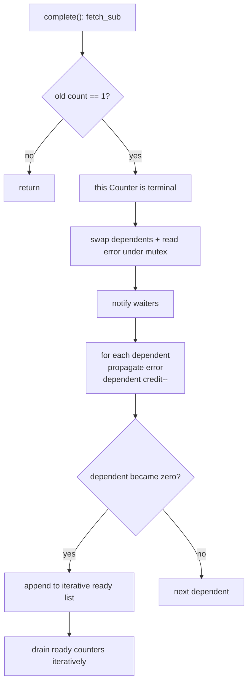
```mermaid
flowchart TD
    D["complete(): fetch_sub"] --> Z{"old count == 1?"}
    Z -->|no| RET[return]
    Z -->|yes| ZERO["this Counter is terminal"]
    ZERO --> SWAP["swap dependents + read error under mutex"]
    SWAP --> NOTIFY["notify waiters"]
    NOTIFY --> PROP["for each dependent<br/>propagate error<br/>dependent credit--"]
    PROP --> READY{"dependent became zero?"}
    READY -->|yes| WL["append to iterative ready list"]
    READY -->|no| NEXT[next dependent]
    WL --> PROP2["drain ready counters iteratively"]
```

The iterative propagation avoids recursive stack growth for deep `combine` chains.

### Invariant C-04 — dependent ownership during pending edge

> A nonterminal source counter stores a `shared_ptr` to each dependent counter, keeping that dependent alive until the source terminal transition consumes the edge.

### Invariant C-05 — registration/completion race is serialized

> `add_dependent()` and terminal-dependent extraction synchronize through the source counter's mutex. An edge is either stored before completion or immediately discharged against an already-completed source; it is not lost between those states.

---

# 21. `combine()`: completion DAG without executable work

`combine()` creates a new counter and completion edges. It does not submit scheduler packets.

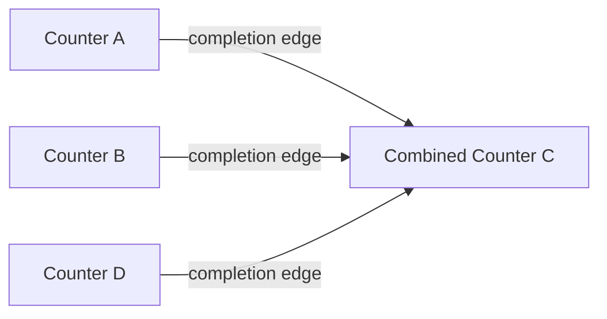
```mermaid
flowchart LR
    A["Counter A"] -->|completion edge| C["Combined Counter C"]
    B["Counter B"] -->|completion edge| C
    D["Counter D"] -->|completion edge| C
```

Construction uses a registration sentinel:

```text
C.count = 1        // registration sentinel
for each valid input:
    C.count++      // dependency edge credit
    input.add_dependent(C)
C.complete()       // release registration sentinel
```

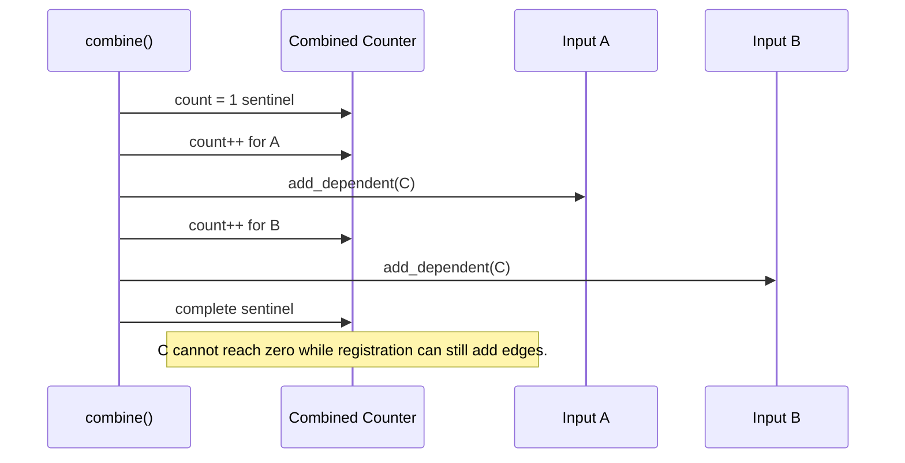
```mermaid
sequenceDiagram
    participant U as combine()
    participant C as Combined Counter
    participant A as Input A
    participant B as Input B

    U->>C: count = 1 sentinel
    U->>C: count++ for A
    U->>A: add_dependent(C)
    U->>C: count++ for B
    U->>B: add_dependent(C)
    U->>C: complete sentinel
    Note over C: C cannot reach zero while registration can still add edges.
```

### Invariant C-06 — registration sentinel

> The combined counter retains one startup credit until every dependency edge has either been registered or synchronously discharged as already complete.

Because `combine` always creates a fresh downstream counter, composition through the public `combine` API naturally builds edges forward into new state. Direct public access to `Counter` is lower-level and can bypass those structural assumptions.

---

# 22. `Pool::for_each`: liveness model

`for_each` creates one shared completion counter with a sentinel.

```text
count = 1                 startup credit
for each chunk:
    count++               chunk credit
    enqueue(chunk, count)
complete()                release startup credit
```

```mermaid
flowchart TD
    S["startup sentinel = 1"] --> LOOP["create chunk"]
    LOOP --> INC["count++"]
    INC --> PUB["enqueue chunk"]
    PUB --> MORE{"more chunks?"}
    MORE -->|yes| LOOP
    MORE -->|no| DROP["drop startup sentinel"]
    DROP --> WAIT["terminal zero only after all chunk credits complete"]
```

If publication throws after incrementing a chunk credit, that credit is rolled back. If the overall submission loop throws after some chunks were already published, the startup sentinel is discharged and the function waits for all already-published range users before rethrowing. This ensures the caller may safely reclaim the range after the function exits by exception.

### Invariant F-01 — range-user drain on partial publication failure

> If `for_each` throws during submission, every previously published chunk is drained before the exception escapes to the caller.

### Callable lifetime

The callable is stored in one `shared_ptr<F>` and shared by all chunks. Therefore concurrent chunks can invoke the **same callable object** simultaneously.

### Invariant F-02 — shared callable concurrency

> If multiple `for_each` chunks execute concurrently, the supplied callable object must tolerate concurrent invocation unless its own state is externally synchronized.

The range elements/iterators themselves remain user-owned; DagFlow only stores/copies iterators.

---

# 23. `Pool::for_each_ws`: recursive work-spawn liveness

`for_each_ws` stores a shared `ProcState` containing:

- `Pool*`,
- range begin iterator,
- one callable `F`,
- options,
- grain size,
- shared completion counter.

Each running range task may split and publish an upper half while continuing with the lower half.

```mermaid
flowchart TD
    R["range [lo, hi)"] --> BIG{"size > 2 * grain?"}
    BIG -->|yes| SPLIT["split at mid"]
    SPLIT --> CREDIT["counter++ for upper child"]
    CREDIT --> PUB["enqueue upper"]
    PUB --> R2["continue current path with lower"]
    R2 --> BIG
    BIG -->|no| EXEC["invoke shared callable on local range"]
```

The current executing packet's own completion credit keeps the operation alive while it is capable of spawning a child. Each child receives a new credit before publication.

### Invariant F-03 — recursive spawn-before-release

> A recursive range executor increments the child credit before publication and cannot discharge its own packet credit until its callable returns.

Thus a child cannot appear after the logical operation has reached terminal zero.

As in `for_each`, the `ProcState` contains one shared callable object. Parallel range executors may invoke it concurrently.

---

# 24. Static graph definition versus per-run state

`TaskGraph` stores reusable definition state:

```text
TaskGraph
  nodes_: vector<unique_ptr<Node>>
  edges_: compiled flat adjacency
  run_state_: shared_ptr<RunState> for the latest run
```

Each `Node` stores persistent information:

- callable,
- build-time successors,
- predecessor count,
- compiled edge range,
- scheduling options,
- initial token count.

Each `run()` creates fresh run-local state:

```text
RunState
  nodes*       borrowed pointer to TaskGraph::nodes_
  edges*       borrowed pointer to TaskGraph::edges_
  pool*        borrowed pointer to Pool
  runtime[]    NodeState per definition node
  completion   shared Counter
  cancel
  first error
```

```mermaid
flowchart TB
    subgraph DEF["Persistent graph definition"]
        TG[TaskGraph]
        N0[Node 0]
        N1[Node 1]
        ED[compiled edges]
        TG --> N0
        TG --> N1
        TG --> ED
    end

    subgraph RUN1["Run #1"]
        R1[RunState #1]
        NS10[NodeState 0]
        NS11[NodeState 1]
        C1[Completion #1]
        R1 --> NS10
        R1 --> NS11
        R1 --> C1
    end

    subgraph RUN2["Later run #2"]
        R2[RunState #2]
        C2[Completion #2]
        R2 --> C2
    end

    R1 -. borrows .-> DEF
    R2 -. borrows .-> DEF
```

### Invariant G-01 — definition persistence

> `Node` objects and their stored callables are definition state and survive successful runs until graph mutation such as `clear()` destroys them.

### Invariant G-02 — fresh runtime state per run

> Each `run()` allocates a new `RunState` and a new `NodeState[]`; predecessor counters, token cursors, lane counters, cancellation, error state, and completion credits are not reused from the previous run.

---

# 25. `RunState` ownership is deliberately partial

Graph scheduler packets capture `shared_ptr<RunState>`, so `RunState` itself remains alive while any such closure still owns it.

However `RunState` contains raw borrowed pointers to:

- `TaskGraph::nodes_`,
- `TaskGraph::edges_`,
- `Pool`.

Therefore `shared_ptr<RunState>` does **not** make the graph definition or pool independently owned.

```mermaid
flowchart LR
    ST["graph ScheduledTask closure"] -->|shared_ptr| RS[RunState]
    RS -. raw borrow .-> N["TaskGraph nodes_/edges_"]
    RS -. raw borrow .-> P[Pool]
```

### Invariant G-03 — graph definition must outlive graph access

> While a run execution path can still access `RunState::nodes` or `RunState::edges`, the owning `TaskGraph` remains alive and those containers remain structurally stable.

### Invariant G-04 — pool must outlive run access

> While a `RunState` can publish or execute graph work, its borrowed `Pool*` remains valid.

The public class-level contract explicitly requires the pool to live through graph destruction.

---

# 26. Graph structural immutability during a run

Operations that structurally mutate or replace run state call `ensure_not_running()`.

If the latest run's completion counter is nonzero, operations such as:

- `emplace`,
- `add_edge`,
- `set_tokens`,
- `clear`,
- `reset`,
- reentrant `run`

are rejected.

```mermaid
stateDiagram-v2
    [*] --> Buildable
    Buildable --> Running: run()
    Running --> Running: execution / cancellation
    Running --> Completed: graph completion == 0
    Completed --> Buildable: mutation / reset / clear
    Completed --> Running: run() again
    Buildable --> Buildable: add node / edge / tokens

    note right of Running
      Structural mutation is rejected.
    end note
```

### Invariant G-05 — definition immutability while live run paths exist

> The graph definition is not structurally mutated while its current run completion counter is nonzero.

The current implementation uses the completion counter itself as the gate for structural safety.

---

# 27. Graph sealing and compiled edges

`seal()` performs a topological cycle check and compiles each node's successor list into one contiguous `edges_` buffer.

A node stores `[edge_begin, edge_end)` indices into this buffer.

Changing graph topology invalidates the sealed state and forces recompilation before the next run.

### Invariant G-06 — compiled edge stability

> During an active run, `edges_` and every node's compiled edge interval remain stable.

This follows from structural immutability.

---

# 28. Graph run startup and startup sentinel

A non-empty `run()`:

1. rejects overlapping execution,
2. seals/checks acyclicity,
3. allocates fresh `RunState`,
4. allocates fresh `NodeState[]`,
5. creates a completion counter with count = 1,
6. initializes predecessor counters,
7. installs `run_state_`,
8. activates and publishes roots,
9. releases the startup credit.

```mermaid
sequenceDiagram
    participant U as Caller
    participant G as TaskGraph
    participant R as RunState
    participant C as Completion Counter
    participant P as Pool

    U->>G: run()
    G->>G: ensure_not_running()
    G->>G: seal / cycle check
    G->>R: allocate fresh run state
    G->>C: count = 1 startup sentinel
    loop each root
        G->>G: activate(root)
        G->>C: +1 published path credit
        G->>P: submit_detached execute(root)
    end
    G->>C: complete startup sentinel
    G-->>U: Handle(C)
```

### Invariant G-07 — root publication sentinel

> Graph completion cannot reach zero while `run()` is still capable of publishing additional root execution paths.

This is the same general “spawner owns liveness” rule used by range algorithms and `combine`.

---

# 29. Node runtime state

Each run has one `NodeState` per definition node:

```cpp
struct NodeState {
    atomic<size_t> predecessors;
    atomic<size_t> next;
    atomic<size_t> lanes;
    size_t tokens;
};
```

Semantics:

- `predecessors`: number of predecessor-node completion barriers not yet observed,
- `next`: next unclaimed token index,
- `lanes`: logical lane count still assigned to the node,
- `tokens`: admitted token count for this run.

### Invariant N-01 — token cursor uniqueness

> Every token index in `[0, runtime.tokens)` can be successfully claimed by at most one lane.

This is enforced by atomic CAS on `next`.

The token itself has no object lifetime; the index is the identity.

---

# 30. Capacity, overflow, and lane creation

Activation starts with `node.initial_tokens`.

### `Overflow::Block`

Despite the name, no worker blocks waiting for capacity. All tokens remain admitted, but parallel execution is constrained by the number of lanes.

`capacity == 0` is invalid for `Block`.

### `Overflow::Drop`

`runtime.tokens` is clipped to `min(initial_tokens, capacity)`.

A zero capacity therefore admits zero user tokens, but one housekeeping lane is still created so node completion/dependency bookkeeping can finish.

### `Overflow::Fail`

If initial tokens exceed capacity:

- the run records a `runtime_error`,
- cancellation is requested,
- admitted token count is subsequently forced to zero,
- housekeeping still drains liveness correctly.

### Lane count

Conceptually:

```text
lanes = max(1,
            min(admitted tokens,
                capacity,
                pool thread count,
                positive concurrency limit))
```

The minimum of one is intentional: even a cancelled or zero-token node may need one logical lane to release bookkeeping safely.

```mermaid
flowchart TD
    A[activate node] --> TOK[load initial_tokens]
    TOK --> OF{overflow policy}
    OF -->|Drop| CLIP[clip tokens to capacity]
    OF -->|Fail and overflow| ERR[record error + cancel]
    OF -->|Block| KEEP[keep tokens]
    CLIP --> LANES[compute lane count]
    ERR --> ZERO[set tokens=0 due cancellation]
    ZERO --> LANES
    KEEP --> LANES
    LANES --> PUB["publish lanes 1..N-1"]
    PUB --> OWN["caller owns final lane"]
```

### Invariant N-02 — lane cap

> Concurrent logical lanes for a node do not exceed the activation limit derived from admitted tokens, capacity, pool size, and configured concurrency.

---

# 31. What a graph lane actually is

A lane is **not** a `ScheduledTask` object.

A lane is a logical execution obligation represented at any instant by either:

- a queued graph scheduler packet,
- a currently executing graph scheduler packet,
- a current execution path that bypassed into a successor,
- a lane being handed off by a budget yield.

This distinction matters because a lane may survive across multiple scheduler packets, and one scheduler packet may execute a chain of node lanes via bypass.

```mermaid
flowchart LR
    L["Logical lane"]
    P1["ScheduledTask packet A"]
    P2["ScheduledTask packet B"]
    N1["Node A"]
    N2["Node B"]

    L -. represented by .-> P1
    P1 -->|executes tokens| N1
    P1 -->|budget handoff| P2
    L -. continues as .-> P2
    P2 --> N1
    P1 -->|or bypass| N2
```

### Invariant L-01 — lane identity is logical, not packet identity

> Scheduler packet lifetime and graph lane lifetime are not one-to-one.

---

# 32. Node execution and token claiming

Within a node, a lane repeatedly:

1. observes cancellation,
2. reads `next`,
3. CAS-claims one token,
4. invokes `node.work(token)`,
5. repeats until no token remains, cancellation is set, or budget yields.

```mermaid
stateDiagram-v2
    [*] --> LaneOwnsNode
    LaneOwnsNode --> CheckCancel
    CheckCancel --> FinishLane: cancelled
    CheckCancel --> Claim
    Claim --> FinishLane: next >= tokens
    Claim --> Invoke: CAS claim succeeds
    Claim --> Claim: CAS loses race
    Invoke --> CheckCancel: callable returns / exception recorded
```

User exceptions are caught at the graph layer, recorded once, and converted into cooperative cancellation. They do not escape out of `TaskGraph::execute()`.

### Invariant N-03 — claimed token is single-consumer

> Once a lane successfully advances `next` for token `i`, no other lane may execute `node.work(i)` for that run.

---

# 33. Persistent node callable lifetime and concurrency

The callable is stored inside the persistent `Node` definition. It is reused across runs.

For a node with more than one lane, multiple threads may concurrently invoke **the same stored callable object**.

This creates two separate user contracts:

1. referenced captures/resources must remain alive during every run in which the node can execute,
2. mutable state inside the callable must be safe for concurrent invocation when node concurrency permits multiple lanes.

### Invariant U-01 — referenced capture lifetime

> DagFlow owns the callable object, but not objects referenced by its captures. Referenced resources must outlive all executions that may dereference them.

### Invariant U-02 — node callable concurrency

> A multi-lane node may invoke one stored callable object concurrently; the callable's internal shared mutable state is the user's synchronization responsibility.

`TaskScope::parallel_for` is a special case: it deliberately creates a separate callable copy per chunk/block and stores those copies persistently in `Parts`.

---

# 34. Lane completion and node barrier

When a lane stops taking tokens, it decrements `runtime.lanes`.

Only the lane that observes the transition from 1 to 0 is the **last lane** and may release successor dependencies.

```mermaid
flowchart TD
    L0[Lane 0 finished tokens] --> D0[lanes--]
    L1[Lane 1 finished tokens] --> D1[lanes--]
    L2[Lane 2 finished tokens] --> D2[lanes--]
    L3[Lane 3 finished tokens] --> D3[lanes--]
    D0 --> X{which decrement sees old value 1?}
    D1 --> X
    D2 --> X
    D3 --> X
    X --> LAST["last lane only"]
    LAST --> SUCC[release successor predecessor counters]
```

### Invariant N-04 — node barrier

> Successor dependency release begins only after the last lane of the predecessor node has stopped executing that predecessor's user tokens.

This is a node-level barrier, not a token-level dependency.

A successor therefore observes the predecessor node as complete only after all admitted tokens have either:

- executed, or
- been skipped due cancellation/drop/failure semantics,

and all predecessor lanes have left the node.

---

# 35. Successor predecessor barrier

For each outgoing edge, the predecessor's last lane decrements the successor's `runtime.predecessors`.

Only the decrement that observes the transition from 1 to 0 activates that successor.

```mermaid
flowchart LR
    A["Predecessor A last lane"] -->|predecessors--| J["Join node runtime"]
    B["Predecessor B last lane"] -->|predecessors--| J
    C["Predecessor C last lane"] -->|predecessors--| J
    J -->|only transition 1 -> 0| ACT[activate successor]
```

### Invariant N-05 — exactly-once successor activation

> For an acyclic sealed graph run, a successor is activated exactly by the edge decrement that transitions its remaining predecessor count to zero.

Duplicate build-time edges count as separate dependencies because `predecessor_count` is incremented for every edge and every compiled edge later performs a decrement.

---

# 36. Bypass: execution-path baton passing

When the last lane of a node makes successors ready, one compatible successor may reuse the current execution path instead of publishing its final lane as a new packet.

Compatibility requires matching:

- affinity option,
- priority.

Other ready successors are published normally.

```mermaid
flowchart LR
    PA["Current packet / completion credit"] --> A["Node A last lane"]
    A --> B{"ready successors"}
    B -->|compatible first successor| C["Node B final lane\nBYPASS"]
    B -->|other successor| PB["new packet + new credit"]
    B -->|other successor| PC["new packet + new credit"]
    C --> D["possibly bypass again"]
```

The current packet's graph completion credit is not discharged between A and B. It is the same live execution path continuing.

### Invariant L-02 — bypass preserves one liveness credit

> Direct node-to-successor bypass transfers the current execution path's liveness responsibility; it does not temporarily drop the run's last credit and reacquire a new one afterward.

This prevents a completion-zero gap between dependent nodes.

---

# 37. Budget yield: lane handoff across scheduler packets

Each `execute()` invocation has a finite budget. After enough work, a lane yields by publishing continuation work for the **same node**.

Critical ordering:

```text
publish continuation     // increments completion counter first
complete old path credit
return
```

`runtime.lanes` is not decremented during this handoff.

```mermaid
sequenceDiagram
    participant Old as Current graph path
    participant C as Graph Counter
    participant P as Pool
    participant New as Continuation packet

    Old->>C: count++ for continuation
    Old->>P: submit_detached(state, same node)
    P-->>New: continuation visible / maybe inline
    Old->>C: complete old path credit
    Old-->>Old: return without lanes--
```

### Invariant L-03 — handoff is not lane completion

> Budget yield changes the scheduler representation of a lane but does not decrement that node's logical lane count.

### Invariant L-04 — publish-before-release

> A lane handoff acquires the continuation credit before releasing the old execution-path credit.

Thus terminal graph zero cannot occur between the two representations of the same logical lane.

---

# 38. Graph completion counter semantics

The graph counter does **not** count tokens and does not directly count nodes.

The best current interpretation is:

> **Number of live graph execution paths/obligations, plus any temporary sentinel, that can still lead to graph access.**

One credit may move through several nodes via bypass. A lane yield may replace the scheduler packet while preserving the logical lane. Activation of additional lanes adds additional credits by publishing them.

```mermaid
flowchart TD
    START["startup sentinel"] --> ROOTS["root path credits"]
    ROOTS --> PATH["execution path"]
    PATH -->|bypass| PATH2["same credit, successor"]
    PATH -->|yield| NEW["new credit published"]
    NEW --> OLDREL["old credit released"]
    PATH2 --> DONE["final complete"]
    OLDREL --> DONE2["continuation eventually completes"]
```

### Invariant G-08 — graph zero means no future definition access from that run

The implementation deliberately places the final `state->completion->complete()` after the last graph-definition access in `execute()`.

> Once the graph completion counter reaches zero, no execution path from that run will later dereference `nodes_` or `edges_`.

This is stronger and more useful than “all scheduler packets have been recycled.”

---

# 39. Graph completion versus pool packet completion

For a graph wrapper packet, the ordering is approximately:

```text
TaskGraph::execute(...)
    last graph access
    graph completion complete()
    return
Pool::execute_task(...)
    wrapper closure returns
    fn.reset()                // destroys captured shared_ptr<RunState>
    allocator.release(packet)
    outstanding_--
```

```mermaid
sequenceDiagram
    participant G as Graph execute()
    participant GC as Graph completion
    participant P as Pool packet
    participant RS as RunState shared ref
    participant A as Allocator

    G->>G: last nodes_/edges_ access
    G->>GC: complete path credit
    Note over GC: may become zero here
    G-->>P: execute() returns
    P->>P: wrapper fn.reset()
    P->>RS: captured shared_ptr released
    P->>A: packet released/reusable
    P->>P: outstanding--
```

Therefore after graph completion zero there may still be:

- a wrapper packet finishing its pool epilogue,
- a `RunState` kept alive briefly by the wrapper capture,
- pool `outstanding_` accounting not yet decremented.

But there must be **no later graph-definition access**.

### Invariant G-09 — definition may die before wrapper epilogue finishes

> After graph completion reaches zero, callers may legally mutate or destroy graph node/edge definitions even if a wrapper packet is still unwinding its pool-level epilogue, because that wrapper may retain `RunState` but must not dereference the definition again.

This invariant is what makes `clear()`, `reset()`, and graph destruction safe after graph completion without requiring `Pool::wait_idle()`.

---

# 40. `TaskGraph` destruction

`TaskGraph::~TaskGraph()` waits on the latest run counter if `run_state_` exists.

If destruction happens inside a worker of the same pool, `Pool::wait()` uses cooperative helping rather than blocking the only worker. The test suite exercises a one-worker pool destroying a graph with a 10,000-node chain from inside a pool task.

```mermaid
sequenceDiagram
    participant W as Pool worker
    participant G as TaskGraph destructor
    participant P as Pool::wait
    participant Q as Scheduler

    W->>G: destroy graph while run active
    G->>P: wait(graph completion)
    loop counter nonzero
        P->>Q: try_acquire/help one
        Q-->>P: graph packet
        P->>P: execute packet
    end
    P-->>G: graph counter zero
    G->>G: nodes_/edges_ may now destruct
```

### Invariant G-10 — destructor barrier

> `TaskGraph` destruction does not destroy definition storage until the latest run's graph completion reaches zero.

### Precondition

The bound pool must still exist during graph destruction because the destructor may call `pool_.wait()` and worker-side waiting may execute additional pool work.

---

# 41. Graph reuse and `reset()`

The graph is currently reusable.

A new `run()` is allowed whenever the previous run's completion count is zero. `reset()` is **not required** before re-running; it merely discards the graph's retained `shared_ptr` to the previous `RunState` after ensuring that run is complete.

A later `run()` replaces `run_state_` with a new run state.

An old completed run can still have:

- an external `Handle` retaining its `Counter`,
- a wrapper packet briefly retaining the old `RunState` after graph completion zero.

Those do not prevent a new run because old run paths are forbidden from touching the definition after zero.

### Invariant G-11 — no overlapping active runs

> A `TaskGraph` has at most one run whose graph completion counter is nonzero.

### Invariant G-12 — completed old run state may coexist transiently

> A new run may exist while storage for an old already-completed `RunState` is still retained by unrelated shared owners, because the old run has lost all authority to access graph definition state.

---

# 42. Cancellation model

Cancellation is cooperative and changes execution rights rather than forcibly destroying runtime objects.

After `cancel == true`:

- a currently executing user callable is allowed to finish,
- lanes stop claiming new tokens,
- successor release/activation is suppressed,
- already-existing lanes still execute their bookkeeping path and release completion credits,
- no exception is implied by explicit cancellation.

```mermaid
stateDiagram-v2
    [*] --> Running
    Running --> CancelRequested: explicit cancel or first graph error
    Running --> UserCallable: token already claimed
    UserCallable --> CancelRequested: callable calls cancel / throws
    CancelRequested --> Cleanup: lanes stop claiming new tokens
    Cleanup --> CreditRelease: lane bookkeeping finishes
    CreditRelease --> Terminal: graph completion reaches zero
```

### Invariant X-01 — cancellation does not invalidate active stack frames

> Cancellation never assumes that an already-running callable has stopped. Objects it may access must remain alive until that callable returns normally or by exception.

### Invariant X-02 — cancelled paths still discharge liveness

> Cancellation skips future user work but does not skip the bookkeeping necessary to decrement lane counts and graph completion credits.

---

# 43. Error model

For graph execution, the first exception is recorded once using `std::call_once`:

1. store `error`,
2. store the error into graph completion counter,
3. publish `has_error`,
4. set cancellation.

Later node exceptions do not replace the first error.

Ordinary `Pool::submit` catches an exception in `execute_task` and stores the first error in the task's `Counter`.

`Pool::wait()` only waits; it does not throw. Error observation is separate via `Handle::rethrow_if_failed()`.

`TaskScope::run_and_wait()` waits and then rethrows its recorded graph error.

### Invariant X-03 — failure does not bypass completion accounting

> A user exception changes error/cancellation state but the execution path still performs normal liveness cleanup.

---

# 44. `TaskScope` ownership and lifecycle

`TaskScope` owns:

- a reference to `Pool`,
- one `TaskGraph`,
- the last run `Handle`,
- `ran_`, `dirty_`,
- last observed graph error.

```mermaid
flowchart TD
    TS[TaskScope] -->|borrows| P[Pool]
    TS -->|owns| G[TaskGraph]
    TS -->|owns current value| H[Handle]
    G -->|borrows| P
```

Its `JobHandle` values do not own graph nodes.

---

# 45. `TaskScope` state model

A useful approximation of the public lifecycle is:

```mermaid
stateDiagram-v2
    [*] --> Clean
    Clean --> Dirty: emplace / then / when_all / parallel_for
    Dirty --> Ran: run()
    Ran --> Ran: run() returns same stored Handle
    Ran --> Clean: wait() consumes stored run handle
    Dirty --> Clean: destructor implicitly run + wait
    Ran --> Clean: destructor waits
    Clean --> Ran: explicit run() reruns existing graph definition
```

Important nuance: `ran_` means “this scope has a stored run not yet consumed by `wait()`”, not necessarily “the underlying graph counter is currently nonzero”. The graph itself uses the counter as the actual execution gate.

## 45.1 `run()`

If `ran_` is already true, `TaskScope::run()` returns the same stored handle and does not create another run.

Otherwise it calls `graph_.run()`, stores the handle, sets `ran_ = true`, and clears `dirty_`.

## 45.2 `wait()`

If no run has been started but the scope is dirty, `wait()` starts it implicitly. Then it waits, snapshots `graph_.last_error()`, clears `ran_`, and releases the stored handle.

## 45.3 Explicit rerun

After `run_and_wait()` has consumed a run, another explicit `run_and_wait()` starts the same graph definition again even though `dirty_ == false`.

The tests intentionally verify this.

## 45.4 Destructor

If a scope is dirty but never started, destruction **runs the graph and waits for it**. If a run is already stored, destruction waits for it. Destructor exceptions are swallowed.

### Invariant TS-01 — destructor is active, not discard-only

> Destruction of an unstarted dirty `TaskScope` causes its pending graph to execute rather than silently dropping it.

This is a strong semantic contract and should not be confused with simple RAII cancellation.

---

# 46. `JobHandle` / `NodeId` lifetime semantics

`JobHandle` contains only a numeric node index. `TaskGraph::NodeId` is similarly just an index wrapper.

They contain no:

- pointer to graph,
- generation number,
- run identity,
- ownership reference.

```mermaid
flowchart LR
    J["JobHandle { id = 3 }"] -. value only .-> IDX["index 3"]
    IDX -. interpreted by current graph container .-> N["nodes_[3]"]
```

### Invariant ID-01 — node handles own nothing

> `JobHandle` and `NodeId` do not extend graph or node lifetime.

### Current contract gap ID-GAP-01 — foreign handles

A `JobHandle` from another graph/scope is not tagged with its origin. If its integer index happens to be valid in the target graph, the runtime cannot detect the mistake.

### Current contract gap ID-GAP-02 — stale handles after `clear()`

A handle retained across `clear()` and graph rebuild can accidentally refer to a new node reusing the same index.

These are identity-safety gaps, not storage ownership bugs inside the current intended usage contract.

---

# 47. `parallel_for` inside `TaskScope`

`TaskScope::parallel_for` differs from `Pool::for_each` in callable storage.

It constructs persistent `Parts`, each containing a block:

```text
Block {
    begin iterator
    end iterator
    callable copy
}
```

The graph node stores a `shared_ptr<Parts>` and token `i` executes block `i`.

```mermaid
flowchart TD
    Node[Persistent graph node] --> Parts[shared Parts]
    Parts --> B0["Block 0: iterators + callable copy"]
    Parts --> B1["Block 1: iterators + callable copy"]
    Parts --> BN["Block N: iterators + callable copy"]
    Token["token i"] --> BI["blocks[i]"]
```

Consequences:

- callable state is isolated per chunk, not per lane,
- callable copies persist across graph reruns,
- stored iterators persist across graph reruns,
- underlying range storage must remain valid on every run that executes this node.

### Invariant U-03 — persistent range validity

> A range referenced by a reusable graph `parallel_for` node must remain valid for every run that may dereference its stored iterators.

---

# 48. Worker-side wait is an execution point

`Pool::wait(handle)` behaves differently depending on caller context.

External caller:

```text
block on Counter::cv until count == 0
```

Worker from the same pool:

```text
while target count != 0:
    try_help_one(this worker)
    otherwise yield
```

```mermaid
flowchart TD
    W[Pool::wait handle ] --> SAME{"caller is worker of same Pool?"}
    SAME -->|no| CV[block on Counter CV]
    SAME -->|yes| LOOP[while counter != 0]
    LOOP --> ACQ[try_acquire any pool work]
    ACQ -->|found| EXEC[execute it]
    EXEC --> LOOP
    ACQ -->|none| Y[yield]
    Y --> LOOP
```

The helped packet need not belong to the target handle.

### Invariant W-01 — wait is reentrant execution

> Calling `Pool::wait()` from a pool worker is a potential reentrant execution point for arbitrary scheduler-visible work in that pool.

User code holding locks or assuming “nothing else on this worker can run while I wait” must account for this.

### Invariant W-02 — cooperative wait prevents single-worker deadlock for visible work

> A worker waiting on work in the same pool does not simply park; it helps execute scheduler-visible packets, allowing nested waits and graph destruction to make progress even with one worker.

This does not solve arbitrary logical dependency deadlocks created by user code.

---

# 49. Worker sleep/wake lifetime relationship

Sleeping is only a scheduling state. A sleeping worker still owns its local queues and allocator shard metadata.

The wake protocol uses:

- `wake_epoch`,
- `sleeping`,
- a mutex/CV handshake,
- a final scheduler scan after announcing sleep.

The important lifetime point is that parking does not transfer ownership of worker-local structures.

### Invariant W-03 — parking retains worker ownership

> A parked worker remains the sole owner for owner-only local deque operations and worker-shard allocator metadata; thieves may steal from its deque, but they do not become deque owners or slab-metadata owners.

---

# 50. Affinity semantics and lifetime

`SubmitOptions::affinity` influences shard selection and graph bypass compatibility, but it is not a hard lifetime pin to one OS worker.

All workers can drain all central shards, and local work can be stolen.

Therefore no user object may rely on affinity as proof that a callable always executes on one particular thread.

### Invariant U-04 — affinity is scheduling metadata, not ownership proof

> Resource lifetime or thread-confinement correctness must not depend solely on DagFlow affinity implying permanent execution on one physical worker.

---

# 51. Memory-ordering relationships relevant to lifetime

This document is not a full weak-memory proof, but several ordering relationships are part of the lifetime model.

## 51.1 Task publication

Initialization of `ScheduledTask` precedes successful queue publication. Queue release/acquire protocols make the packet contents visible to the acquiring worker/thief.

## 51.2 Lane barrier

`runtime.lanes.fetch_sub(..., acq_rel)` gives the final lane an acquire/release synchronization point across lane departures. The last lane is the only lane that releases successor dependencies.

## 51.3 Predecessor barrier

Successor `predecessors.fetch_sub(..., acq_rel)` operations serialize predecessor completion edges. The final transition to zero is the activation point for the successor.

## 51.4 Cancellation

Cancellation is published with release stores and observed with acquire loads before claiming new user tokens or releasing successors.

## 51.5 Completion counters

Counter decrements use acquire-release semantics. Waiters observe zero with acquire loads/CV predicate checks. Completion state and first-error storage are synchronized so terminal observation does not race unprotected access to the recorded exception.

### Invariant M-01 — ownership transfer requires publication ordering

> A custody transfer to another thread is valid only when the receiving side observes the initialization and state required to use the object safely. Queue and atomic protocols provide that publication boundary.

---

# 52. Full ordinary task timeline

```mermaid
sequenceDiagram
    participant U as Submitter
    participant A as TaskAllocator
    participant O as outstanding_
    participant Q as Scheduler
    participant W as Worker
    participant C as Counter

    U->>C: create count=1
    U->>A: acquire slot
    A-->>U: ScheduledTask*
    U->>U: initialize fn/prio/done
    U->>O: ++
    U->>Q: publish packet
    Q-->>W: acquire packet
    W->>W: invoke fn
    opt callable throws
        W->>C: set first exception
    end
    W->>W: move done<br/>fn.reset()
    W->>A: release slot
    W->>C: complete credit
    Note over C: Handle may now observe completion
    W->>O: --
    Note over O: wait_idle accounting closes later
```

---

# 53. Full graph execution timeline

```mermaid
sequenceDiagram
    participant U as Caller
    participant G as TaskGraph
    participant GC as Graph Counter
    participant P as Pool
    participant ST as ScheduledTask wrapper
    participant R as RunState
    participant N as Node definition

    U->>G: run()
    G->>R: create fresh RunState
    G->>GC: startup credit = 1
    G->>GC: + root execution credit
    G->>P: submit_detached([R, root])
    G->>GC: release startup credit
    P->>ST: allocate + queue wrapper
    ST->>R: shared_ptr capture keeps RunState alive
    P->>ST: execute wrapper
    ST->>R: execute(root)
    R->>N: borrow node definition
    loop tokens / successors / bypass
        R->>N: invoke/inspect
    end
    R->>GC: complete current path after last graph access
    Note over GC: may reach zero
    R-->>ST: execute returns
    ST->>ST: wrapper fn.reset
    ST->>R: release capture
    P->>ST: allocator release
    P->>P: outstanding--
    U->>G: after graph zero, clear/reset/destroy/rerun is allowed
```

---

# 54. Ownership/custody/liveness matrix

| Entity | Storage owner | Who may access it concurrently? | Custody rule | Liveness mechanism | Terminal/reclaim condition |
|---|---|---|---|---|---|
| `Pool` | caller/object scope | workers + submitters under API contract | N/A | external contract + worker joins | caller destroys only when quiescent |
| `Worker` | `Pool` | owning worker + notifiers read/update wake state | owner thread for worker-local execution state | pool lifetime | after worker joined |
| local deque | `Scheduler` | one owner + many thieves | successful pop/steal transfers packet custody | none | scheduler destruction after all users stop |
| central queue | `Scheduler` | MPMC | successful push/pop transfers packet custody | none | scheduler destruction after all users stop |
| `ScheduledTask` | allocator slab | current custodian only, except queue atomic pointer transport | exactly one logical custodian | pool `outstanding_`; optional operation Counter | released to allocator after callable reset |
| allocator `Block` | allocator shard | shard owner metadata; remote threads only publish slots | N/A | slot-return accounting | owner may delete when fully free and spare policy allows |
| `Counter` | shared_ptr owners | atomic count + mutex-protected auxiliary state | N/A | its own credits | object freed after last shared_ptr; operation complete at count zero |
| `TaskGraph::Node` | `TaskGraph` | active run lanes may read/invoke | not queued | graph completion prevents unsafe mutation/destruction | clear/destructor after run zero |
| `RunState` | shared_ptr owners | graph execution paths | N/A | shared_ptr + graph completion | last shared_ptr after all captures/graph ref gone |
| `NodeState` | `RunState` | graph lanes | logical lane/token atomics | graph completion | RunState destruction |
| graph lane | logical | one current execution representation | one path or handoff target | one graph execution-path credit | last lane decrement + path completion |
| token | logical index | claimed atomically | claim once | covered by its lane/path | callable returns or token skipped |
| `JobHandle` | caller value | value copy | none | none | ordinary value lifetime |

---

# 55. Global invariant catalog

This section collects the model into a compact review checklist.

## Pool and worker invariants

**P-01 — worker backing state**  
Worker-accessed `Pool`, `Worker`, scheduler, and allocator state outlive worker execution.

**P-02 — destruction requires quiescence**  
Pool destruction is valid only when no work can still require the pool; destructor is not a drain.

**W-01 — wait is reentrant execution**  
Worker-side wait may execute arbitrary visible pool work.

**W-02 — cooperative progress**  
A same-pool worker waiting for completion helps execute work rather than blocking on the CV.

**W-03 — parking retains ownership**  
Worker parking does not transfer owner-only deque or allocator-shard authority.

## Scheduler packet and queue invariants

**T-01 — initialize before publication**  
Packet state is initialized before custody transfer.

**T-02 — recycle before handle completion is allowed**  
Packet storage does not need to survive Handle completion publication.

**S-01 — single custody**  
A live packet has one logical custody owner.

**S-02 — successful transfer revokes sender authority**  
After successful push/pop/steal transfer, the previous custodian no longer acts on the packet.

**S-03 — failed transfer preserves caller authority**  
Failed queue publication/acquisition does not silently transfer ownership.

**S-04 — external backpressure preserves custody**  
External retry loops retain packet custody until central publication succeeds.

**S-05 — stolen siblings visible before first execution**  
Batch-stolen siblings are published before executing the returned first packet.

**Q-01 — stale pointer bits are not references**  
Queue indices/protocol state define membership, not residual cell contents.

**Q-02 — local queue destruction after all users stop**.

**Q-03 — reserved MPMC positions complete their protocol**.

**Q-04 — queue emptiness is not completion**.

## Allocator invariants

**A-01 — released slot remains constructed**.

**A-02 — one metadata owner per worker shard**.

**A-03 — external shard mutation is mutex-serialized**.

**A-04 — no slot access after remote-return publication**.

**A-05 — slab reclaim occurs only under origin-shard ownership and full-free accounting**.

## Completion/liveness invariants

**C-01 — balanced credits**  
Every acquired credit has one discharge.

**C-02 — terminal zero**  
Operation-specific zero is absorbing; no new credits appear afterward.

**C-03 — spawner covered by liveness**  
Any path capable of creating children is itself covered by an existing credit/sentinel.

**C-04 — source retains dependent while completion edge is pending**.

**C-05 — completion-edge registration cannot be lost against source completion**.

**C-06 — combine registration sentinel prevents premature terminal zero**.

**O-01 — pool outstanding spans queue transfers**.

**O-02 — parent execution remains counted while publishing children**.

**O-03 — pool idle zero is observational, not absorbing**.

## Graph definition/run invariants

**G-01 — node definitions persist across runs until structural destruction**.

**G-02 — run-local state is fresh per run**.

**G-03 — graph definition outlives every run path that can dereference it**.

**G-04 — bound pool outlives run paths and graph destruction**.

**G-05 — active run implies structural definition immutability**.

**G-06 — compiled edges remain stable during a run**.

**G-07 — startup sentinel protects root publication**.

**G-08 — graph completion zero means no future definition access from that run**.

**G-09 — definition may be destroyed after graph zero even if pool wrapper epilogue is still finishing**.

**G-10 — graph destructor waits to the definition-safety barrier**.

**G-11 — at most one nonterminal run per graph**.

**G-12 — completed old RunState storage may coexist with a new run but has no definition-access authority**.

## Node/lane/token invariants

**N-01 — token claims are unique**.

**N-02 — lane parallelism respects activation limits**.

**N-03 — one successful token claimant executes that token**.

**N-04 — successor release occurs only from the predecessor's last lane**.

**N-05 — successor activation occurs on exactly one predecessor-counter transition to zero**.

**L-01 — lane identity is not scheduler-packet identity**.

**L-02 — bypass transfers the existing execution-path credit**.

**L-03 — budget yield is a lane handoff, not lane completion**.

**L-04 — handoff publishes continuation before releasing the old path credit**.

## Cancellation/error invariants

**X-01 — cancellation does not invalidate active callables**.

**X-02 — cancelled execution still performs bookkeeping and discharges liveness**.

**X-03 — exceptions change error/cancel state, not completion obligations**.

## User-resource invariants

**U-01 — reference captures remain caller-owned and must outlive every dereference**.

**U-02 — multi-lane persistent node callable may be invoked concurrently**.

**U-03 — reusable `parallel_for` stored iterators/ranges remain valid across every rerun**.

**U-04 — affinity is not a hard thread-ownership guarantee**.

## Scope/identity invariants

**TS-01 — dirty `TaskScope` destruction executes and waits for pending work**.

**ID-01 — `JobHandle`/`NodeId` own no node storage**.

**M-01 — cross-thread custody transfer requires the corresponding publication ordering**.

---

# 56. Preconditions visible at the public API boundary

The current implementation relies on the following user-visible preconditions.

## `Pool`

- Do not destroy the pool concurrently with active/submitting work.
- `wait_idle()` must not be called from a worker of the same pool.
- A handle may outlive the pool only if the operation no longer needs pool execution.

## `TaskGraph`

- Keep the bound pool alive through graph destruction.
- Build/mutate/run/reset/clear are expected to be externally serialized as documented.
- Do not structurally mutate while a run is nonterminal.
- Captured references must remain valid for every relevant run.
- Multi-lane node callable state must tolerate concurrent calls.

## `TaskScope`

- Treat `JobHandle` as a scope-local build-time node identifier.
- Do not use a handle from a different scope/graph.
- Do not assume destruction discards dirty work; it executes it.

## Range algorithms

- Keep referenced range storage valid until operation completion.
- Shared callable state in `Pool::for_each` / `for_each_ws` may be invoked concurrently.
- Reusable graph `parallel_for` keeps iterator/callable-copy state across runs.

---

# 57. Current contract holes and sharp edges

These are not necessarily bugs in intended usage, but they are places where the type system does not encode the lifetime model.

## 57.1 Pool destruction does not enforce its quiescence precondition

The API comment says the pool must outlive submitted work/graphs, but the destructor itself does not assert `outstanding_ == 0`, drain queued work, or reject late submitters.

**Risk:** violation becomes stranded work or dangling pool borrows rather than a deterministic contract failure.

## 57.2 `RunState` shared ownership can look stronger than it is

A packet owns `RunState`, but `RunState` only borrows graph definition and pool storage.

**Risk:** future refactors may incorrectly assume `shared_ptr<RunState>` alone makes all referenced runtime state safe.

## 57.3 `JobHandle` lacks graph/generation identity

Foreign or stale numeric handles can be accidentally accepted if the index exists.

**Risk:** logical graph corruption without immediate lifetime failure.

## 57.4 `TaskScope::ran_` is not identical to graph nonterminal state

A scope can retain `ran_ == true` after the graph counter has independently reached zero until `wait()` consumes the stored run. The graph itself gates mutation on the actual counter.

**Risk:** future scope state-machine changes can conflate “stored handle not consumed” with “execution active”.

## 57.5 Same callable object may be concurrently invoked

This applies to ordinary multi-lane graph nodes and pool range algorithms that share one callable object.

**Risk:** mutable lambda/functor capture races can be surprising if users think “tasks” imply copied callable instances.

## 57.6 Queue and pool-idle states are deliberately different from operation completion

A queue can be empty while work is executing, privately transferring, or temporarily unpublished inside an MPMC reservation. `outstanding_` can be nonzero after a specific handle reaches zero.

**Risk:** future optimizations must not replace explicit completion accounting with queue snapshots.

---

# 58. Derived safety properties

Given the invariants above, several useful properties follow.

## 58.1 Safe packet recycling

Because:

- queues only transport pointers while they own custody,
- successful acquisition removes custody from the queue,
- the executor is the only remaining custodian,
- `Handle` owns only `Counter`,

then the executor may release the packet slot before publishing the operation's final completion.

## 58.2 Safe graph clear after completion

Because graph completion zero is after the last definition access, `clear()` can destroy nodes/edges once `ensure_not_running()` observes zero, even if an old wrapper still retains `RunState` during pool epilogue.

## 58.3 Safe graph rerun without waiting for pool idle

A completed run has lost all graph-definition-access authority. Therefore a new `RunState` may use the same immutable definition while old completed wrapper epilogues finish.

## 58.4 No premature graph zero during continuation handoff

Budget yield performs:

```text
new credit + publication
then old credit discharge
```

so the graph cannot hit terminal zero in the middle of lane transfer.

## 58.5 No premature graph zero during root publication

The startup sentinel exists until all roots have been activated/published.

## 58.6 Successor sees a full node barrier

Only the last predecessor lane releases outgoing edges, so no successor is activated while another lane of that predecessor is still inside its node execution loop.

---

# 59. What is *not* owned by DagFlow

It is useful to be explicit about resources that are only borrowed from user code.

DagFlow does **not** automatically extend the lifetime of:

- objects captured by reference,
- raw pointers captured by value,
- range storage behind stored iterators,
- resources hidden behind callable references,
- external synchronization primitives,
- the `Pool` referenced by a graph/scope.

```mermaid
flowchart LR
    DF["DagFlow-owned callable object"] -->|may contain borrow| REF["user object & / pointer"]
    DF -->|may store iterator| RNG["user range storage"]
    G[TaskGraph] -. borrows .-> P[Pool]

    Note["Owning the wrapper is not owning the referent"]
```

The runtime owns the wrapper/copy that contains those references; it does not promote them into shared ownership.

---

# 60. Practical review rules for future runtime changes

Any future change to queues, task storage, graph execution, or handles should be reviewed against these questions.

### Storage

1. What object owns the memory?
2. Can its address be published elsewhere?
3. What event makes storage reusable?
4. Can any stale container cell still contain its old address after reuse?
5. Who alone may reclaim the containing slab/container?

### Custody

1. Who owns the right to execute this work before the operation?
2. Exactly what successful operation transfers that right?
3. What happens on failed publication?
4. Is there ever a moment when two actors believe they both own the same work?
5. Is there ever a moment when nobody owns it?

### Liveness

1. What credit prevents terminal zero while this code can spawn more work?
2. Is the new credit acquired before publication?
3. Is rollback exact if publication throws?
4. Is old credit released only after the continuation is safe?
5. What does zero guarantee: no packets, no user code, no graph access, or just no logical children?

### Borrowed lifetime

1. Which raw/reference fields are being dereferenced?
2. What completion barrier proves their owner still exists?
3. Does shared ownership of an intermediate state accidentally hide a raw borrow?
4. Can a completed old execution object survive after its authority to dereference borrowed state has ended?

### Reentrancy

1. Can this path call `Pool::wait()` from a worker?
2. If so, what other tasks can run reentrantly?
3. Is a lock/resource held across that wait?
4. Can inline overflow execution recurse into code that assumes publication is asynchronous?

---

# 61. Compact mental model

The current runtime can be summarized with four sentences:

1. **Allocator owns packets; scheduler owns only packet custody.**
2. **Handles own completion state; they do not own packets.**
3. **Graph definitions own persistent callables; `RunState` owns only per-run state and borrows the definition/pool.**
4. **Completion credits, not queue contents, determine when an operation has lost the authority to create or access more work.**

The corresponding picture is:

```mermaid
flowchart TB
    subgraph Definition["Persistent definition lifetime"]
        TG[TaskGraph]
        NODE[Nodes + callables + compiled edges]
        TG --> NODE
    end

    subgraph Run["Per-run logical lifetime"]
        RS[RunState]
        NS[NodeState array]
        GC[Graph completion credits]
        RS --> NS
        RS --> GC
        RS -. borrows .-> NODE
    end

    subgraph Scheduling["Scheduler packet lifetime"]
        AL[TaskAllocator slab]
        ST[ScheduledTask]
        Q[Local/Central queues]
        EX[Executor]
        AL --> ST
        ST --> Q
        Q --> EX
        EX -->|release| AL
        ST -->|graph wrapper owns| RS
    end

    subgraph Completion["Completion object lifetime"]
        H[Handle]
        C[Counter]
        H --> C
        ST -. optional credit discharge .-> C
    end

    EX -. executes/inherits logical lane .-> GC
```

---

# 62. The key distinction for the next design phase

The current implementation already implicitly separates the right concepts; they are simply not all first-class in the API/types.

A future explicit model should preserve the distinction:

```text
storage owner
    !=
execution custodian
    !=
liveness owner
    !=
borrowed-resource owner
```

For example, for one graph continuation:

```text
TaskAllocator                  owns ScheduledTask storage
scheduler/local deque          owns packet custody
shared_ptr<RunState>           owns run-state storage
TaskGraph                      owns Node definition storage
graph completion credit       owns logical run liveness
current execution path        owns logical lane custody
user                           owns objects captured by reference
```

Trying to collapse these into one “task owns everything until finished” concept would make the existing optimizations—stealing, packet reuse, bypass, lane handoff, reusable graph definitions, completion edges—much harder to state correctly.

The current architecture is therefore best understood as a set of **explicit transfer protocols between independently-lived layers**, not as a tree of nested task objects.

---

# 63. Canonical invariant diagram

```mermaid
flowchart LR
    subgraph USER["User lifetime"]
        UR["referenced resources / ranges"]
        P[Pool]
        G[TaskGraph]
    end

    subgraph DEF["Definition"]
        N["Node + persistent callable"]
        E["compiled edges"]
    end

    subgraph RUN["Run"]
        RS[RunState]
        NS[NodeState]
        CR["graph liveness credits"]
        L["logical lane"]
    end

    subgraph PACKET["Packet"]
        A[TaskAllocator]
        T[ScheduledTask]
        Q[Scheduler queue]
        X[Executor]
        O[Pool outstanding]
    end

    subgraph HANDLE["Completion state"]
        H[Handle]
        C[Counter]
    end

    G --> N
    G --> E
    G -. borrows .-> P
    RS -. borrows .-> N
    RS -. borrows .-> E
    RS -. borrows .-> P
    RS --> NS
    RS --> CR
    L --> CR
    T -->|graph closure shared_ptr| RS
    A -->|storage ownership| T
    T -->|custody transfer| Q
    Q -->|custody transfer| X
    X -->|release/reuse| A
    T -. accounted by .-> O
    T -. optional done .-> C
    H --> C
    N -. callable may borrow .-> UR

    CR -. "zero => old run cannot access definition again" .-> G
```

This is the full current lifetime model in one diagram:

- **solid ownership edges** show actual storage ownership/shared ownership,
- **custody edges** show exclusive scheduler authority transfer,
- **dotted borrows** require external lifetime barriers,
- **credit/accounting relations** define logical completion independently of storage reuse.

---

# 64. Final current-state contracts

For the current implementation to remain correct, the following high-level statements must all stay true:

1. A packet is never reclaimed while a valid scheduler custodian can still dereference it.
2. A queue never needs to own packet storage; it only needs custody to remain exclusive until successful acquisition.
3. Remote allocator release never mutates foreign slab metadata after publishing the returned slot.
4. Operation completion never reaches zero while any participant still has authority to spawn another credit for that operation.
5. Graph completion never reaches zero while any old run path can later dereference graph definition state.
6. A successor never runs before the predecessor node's final lane has crossed the node-completion barrier.
7. A lane handoff never creates a liveness gap between old and new representations.
8. Cancellation never skips mandatory cleanup/decrement paths.
9. Graph definition lifetime is protected by graph completion, not by `shared_ptr<RunState>` alone.
10. Pool lifetime is an external root precondition; the current pool destructor does not repair violations by draining.
11. User-owned referenced state has independent lifetime and synchronization obligations.
12. `Handle` and `JobHandle` are fundamentally different: the former owns completion state; the latter is only an untagged graph index.

These are the invariants against which a redesigned task/lane/queue/handle lifetime model should be compared.
