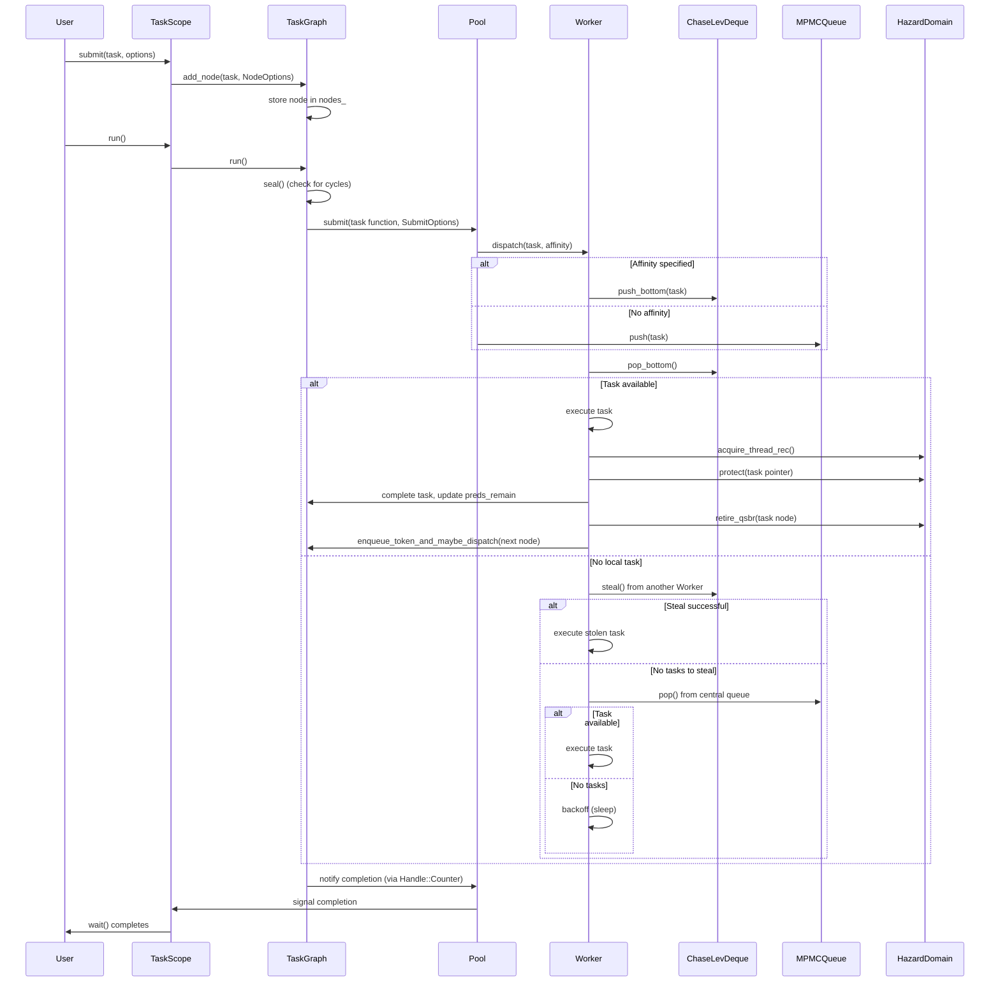

### Architecture

How it works:

```mermaid
sequenceDiagram
    participant User
    participant TaskScope
    participant TaskGraph
    participant Pool
    participant Worker
    participant ChaseLevDeque
    participant MPMCQueue
    participant HazardDomain

    User->>TaskScope: submit(task, options)
    TaskScope->>TaskGraph: add_node(task, NodeOptions)
    TaskGraph->>TaskGraph: store node in nodes_
    User->>TaskScope: run()
    TaskScope->>TaskGraph: run()
    TaskGraph->>TaskGraph: seal() (check for cycles)
    TaskGraph->>Pool: submit(task function, SubmitOptions)
    Pool->>Worker: dispatch(task, affinity)
    alt Affinity specified
        Worker->>ChaseLevDeque: push_bottom(task)
    else No affinity
        Pool->>MPMCQueue: push(task)
    end
    Worker->>ChaseLevDeque: pop_bottom()
    alt Task available
        Worker->>Worker: execute task
        Worker->>HazardDomain: acquire_thread_rec()
        Worker->>HazardDomain: protect(task pointer)
        Worker->>TaskGraph: complete task, update preds_remain
        Worker->>HazardDomain: retire_qsbr(task node)
        Worker->>TaskGraph: enqueue_token_and_maybe_dispatch(next node)
    else No local task
        Worker->>ChaseLevDeque: steal() from another Worker
        alt Steal successful
            Worker->>Worker: execute stolen task
        else No tasks to steal
            Worker->>MPMCQueue: pop() from central queue
            alt Task available
                Worker->>Worker: execute task
            else No tasks
                Worker->>Worker: backoff (sleep)
            end
        end
    end
    TaskGraph->>Pool: notify completion (via Handle::Counter)
    Pool->>TaskScope: signal completion
    TaskScope->>User: wait() completes
```