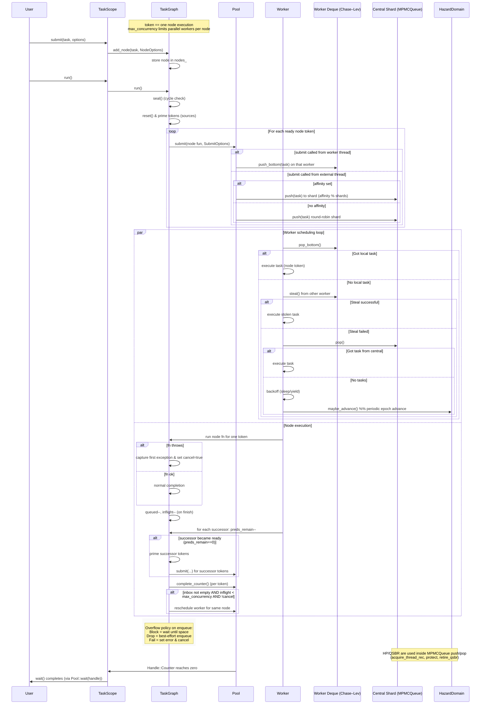

### Architecture

How it works:

### Why not TBB
This runtime is not a full general-purpose task scheduling framework like Intel oneTBB.
It’s a focused, lightweight, single-run DAG executor designed for cases where you build a small or medium dependency graph and run it once (or a few times), rather than keeping a long-lived task arena alive.

**Main differences vs TBB-style runtimes:**

1. **Single-run DAG model**  
   - You explicitly build a graph (`TaskGraph` or via the higher-level `TaskScope`) with known dependencies.  
   - Once you call `run()`, the graph is *sealed* (cycle check, static indegrees calculated) and executed to completion.  
   - No implicit dynamic spawning of tasks during execution (although each node can submit more tokens of itself via `parallel_for` or rescheduling).

2. **Token-based execution model**  
   - Each node’s *unit of work* is a **token** (one execution of `fn`).  
   - Nodes can have `max_concurrency` limits and back-pressure via inbox `capacity` + `Overflow` policy (`Block`, `Drop`, `Fail`).  
   - This makes per-node load control and memory bounds *deterministic* — something TBB does not directly expose.

3. **Integrated back-pressure and overflow control**  
   - In TBB, tasks pile up in queues if producers outpace consumers; here you can choose to block, drop, or fail when inbox capacity is reached.  
   - This is critical in real-time-ish or bounded-memory pipelines.

4. **Explicit `ScheduleOptions` with affinity and priorities**  
   - You can pin a node’s tokens to a specific worker (or shard) and give them `High` vs `Normal` priority.  
   - Affinity is respected even for fan-out reschedules, unlike TBB which mostly relies on work stealing locality heuristics.

5. **Work-stealing pool as a standalone, minimal runtime**  
   - Under the hood is a Chase–Lev per-worker deque + central MPMC shards for external submissions.  
   - You can use the pool directly without TaskGraph, like a very lean replacement for `std::thread` + `std::async` — without heavy allocators or global state.

6. **Integrated memory reclamation for lock-free structures**  
   - Hazard Pointers + QSBR domain is part of the runtime.  
   - MPMC queues and other internals are safe for lock-free pushes/pops without external GC or RCU glue.

7. **Small-function and small-vector for zero-dependency, allocation-friendly core**  
   - No `std::function` allocations for tiny callables.  
   - Inline storage for small vectors without heap hits.

8. **Minimal ABI & zero global singletons**  
   - You own the `Pool` and `TaskScope`. No hidden thread arenas or global TLS registries (except hazard-domain TLS).  
   - Easy to embed in game engines, simulation loops, or tools where you need predictable teardown.
