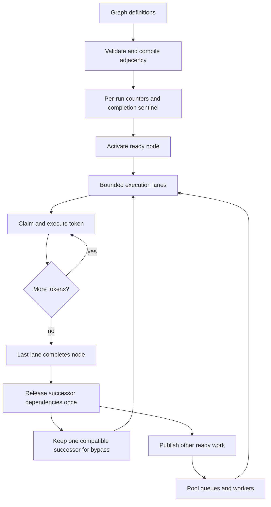

# Runtime architecture

DagFlow separates graph definitions, per-run state, task scheduling, completion,
and task storage. See [code organization](code_organization.md), the
[implementation plan](runtime-improvement-plan.md), and
[benchmark results](runtime-benchmark-results.md).

## Execution

```mermaid
flowchart TD
    Build[Graph definitions] --> Seal[Validate and compile adjacency]
    Seal --> Run[Per-run counters and completion sentinel]
    Run --> Ready[Activate ready node]
    Ready --> Lanes[Bounded execution lanes]
    Lanes --> Work[Claim and execute token]
    Work --> Remaining{More tokens?}
    Remaining -->|yes| Work
    Remaining -->|no| Barrier[Last lane completes node]
    Barrier --> Successors[Release successor dependencies once]
    Successors --> Next[Keep one compatible successor for bypass]
    Successors --> Publish[Publish other ready work]
    Next --> Lanes
    Publish --> Pool[Pool queues and workers]
    Pool --> Lanes
```

A graph supports sequential repeated runs; concurrent runs of the same graph are
rejected. Node callables and build-time successor lists belong to the graph.
The builder retains mutable successor lists and original options. `seal()`
validates acyclicity and creates a separate CSR snapshot: contiguous `NodeDef[]`
with edge ranges, contiguous `uint32_t Edge[]`, and a compact root-index array.
The root list is rebuilt after mutation; a former root may now have a predecessor.
It also normalizes submission
options, admitted token counts, overflow checks and lane counts. Callables move
into the snapshot only after all allocations succeed; a failed seal preserves
existing callable state and newly added callables for retry.

The graph owns reusable `NodeState[]` and initial-driver packet arrays, grown at
seal when necessary. The latter reserves one packet per node, used at most once
per run; direct successor bypass may leave a node's slot unused.
Each run resets multi-predecessor join counters and creates its own cancellation,
error and completion state. Activation initializes token/lane counters before
publishing any lane, including when an earlier cancelled run never reached that
node. Startup publishes the compiled roots rather than scanning all nodes again.
`RunState` borrows spans of compiled nodes, edges, node state and initial packets,
with no pointers to builder containers. Its allocation is reused after completion;
the object is reconstructed to reset cancellation, error and once_flag together.
Each run still creates a fresh CompletionState, so old Handles keep their own
results. `reset()` retains compiled topology, RunState allocation and array
capacity; `clear()` releases them. Mutation is
allowed only after the active run completes and invalidates the compiled snapshot.

Internal node indices, CSR offsets, predecessor counters and lane counts use
`uint32_t`. Graphs reject more than `UINT32_MAX` nodes or edges before narrowing;
`UINT32_MAX` is reserved as the no-node index. Public `NodeId` inputs remain
`size_t` and are bounds-checked. Token counts and token cursors remain `size_t`,
including support for `SIZE_MAX` tokens.

A token means one invocation, not an independently owned data payload. A node's
successors become ready after **all admitted invocations** have finished.
Concurrency is limited by the node setting, capacity, and the pool thread count.
`concurrency <= 0` removes the node-specific concurrency bound.

Capacity limits live admitted executions per node:

- `Block`: defer excess tokens; workers never block waiting for node capacity.
- `Drop`: execute only the first `min(tokens, capacity)` invocations in the run.
  A node with zero admitted tokens still releases its successors.
- `Fail`: record an error and cancel the run when the initial token count exceeds
  capacity. Independent work that already started may finish.
- Zero capacity is rejected for `Block`; it is supported for `Drop` and `Fail`.

Capacity is not a bound on all tasks or memory in the pool. This is a finite DAG
contract, not a streaming producer/consumer pipeline.

An ordinary node with one admitted invocation executes directly, without a token
cursor or token continuation; its compiled lane count is necessarily one.
Tokenized nodes retain bounded CAS claims so a `SIZE_MAX` token limit cannot wrap
the cursor. The final lane releases outgoing relationships once; only
multi-lane nodes need an acquire/release lane join. Likewise, a single incoming
edge has one releaser, while multiple incoming edges (including duplicate edges)
retain an acquire/release arrival counter to gather all predecessor writes.

One ready successor with matching priority and affinity can
continue directly on the current worker. A budget of 64 token/transition steps
returns execution to the scheduler through publication; this avoids queue
operations on every graph edge. Exhausting the budget on the last token finishes
the lane directly, without an empty continuation. With concurrent lanes another
lane may consume the remaining work after the continuation probe; that race is
harmless because the continuation still owns its lane. Queue saturation spills
into shared overflow storage without invoking the continuation from submit.

See [graph execution validation and measurements](experiments/graph-execution.md)
for the single-invocation and join protocol, regression coverage, and paired results.

Completion counts accepted lane drivers plus a startup sentinel rather than a
sum of all theoretical tokens. Cancellation skips unstarted invocations and
nodes; already executing callables finish. Publication failure records an error
and retires that lane without leaving an outstanding count. The graph exclusively
owns run state; packets borrow it under live completion credits. No run-state or
node-definition access occurs after the last credit retires, allowing mutation
or destruction as soon as the result becomes ready.

Initial root/successor publication borrows its node's reserved packet. Pool's
erased release callback ends that borrow before finishing the packet credit;
the same ordering applies if producer registration rejects publication. No
executor accesses the slot after release. This is why the next run may reuse
slots immediately after ready(), without waiting for unrelated pool epilogues.
Additional lanes and same-node token continuations keep ordinary allocated
packets: the previous packet may still be in its epilogue, so reusing a node slot
within the same run would race. Budgeted handoff to a not-yet-executed successor
can use that successor's initial slot. See the
[allocation experiment](experiments/graph-allocations.md) for counts, timings
and the retained-storage tradeoff.

`TaskGraph::cancel()` requests cooperative cancellation; synchronize it against
run/reset/clear. Cancellation alone is not an exception. Mutable callable state
persists across runs, so the caller remains responsible for its semantics.
`GraphScope::parallel_for` uses per-run token indices and can process its range
again on subsequent explicit runs. Repeated `wait()` and destruction do not
implicitly rerun an already completed scope.

## Dynamic structured tasks

`TaskScope` schedules callbacks immediately through `spawn` (or `submit`) and
joins them on destruction. `GraphScope` is the reusable DAG builder. A dynamic
scope is one-shot: `join()` closes external admission, waits for all descendants
and rethrows the first error; `wait()` performs the same drain without rethrowing.

Open admission owns one sentinel credit. An accepted publisher first reserves a
credit under the admission mutex, then constructs and publishes its callback.
The publisher retains that credit through construction and publication cleanup;
the executor owns a separate credit through callback and capture destruction.
A running callback receives a borrowed `Context&` and may fork children even
after `close()` closes external admission. Cancellation or the first error
closes both admission paths; queued callbacks check cancellation before invoking
user code. Running callbacks may poll `Context::cancelled()`.

The final credit publishes completion exactly once. At this point all task-side
borrows of the scope state have ended; the scope owner may release its state.
Only completion bookkeeping and pool epilogues can remain. A `Handle` observes
completion without extending admission. Self/active-ancestor joining is rejected,
including during callable cleanup and cooperative nested waits.
See [the full lifetime contract](task-scope-lifetime.md).

## Scheduler and ingress

Each worker owns bounded High and Normal Chase–Lev deques. External threads use
bounded sharded Vyukov MPMC queues. Workers share one acquisition path with
cooperative waits: local queues, the home central shard, stealing, and other
central shards.

Every 32 acquisitions, a worker probes central queues before normal local work.
The first shard rotates after successful acquisition. High work remains
preferred at these probes. This ensures service opportunities for shared ingress
under same-priority local refill; it is not a wall-clock deadline. Continuous
High work may delay Normal work, and graph bypass can execute several nodes
between acquisitions.

`SubmitOptions::mode` distinguishes two policies:

- `SubmissionMode::Spawn` (default): worker submissions prefer their local deque,
  then their home central shard.
- `SubmissionMode::Enqueue`: worker submissions use shared ingress, useful for
  independent work. If the selected central queue is full, use its overflow queue.

External submissions always use shared ingress and retry when it is full.
Workers never wait for queue capacity; ordinary Spawn uses a shared intrusive
overflow queue if both local and central queues are full. Overflow links are
protected by a mutex and need no additional allocation. Affinity is a placement
hint, not a guarantee of execution on a particular worker.

Scalar external submission prepares one pool-owned packet, reserves external
admission, records publication
in the producer lane, then transfers the packet to a shard ingress. A full
ingress applies backpressure to the external caller; a worker never waits for
capacity and spills its incoming packet when both local and central queues
reject it. `submit_detached` has no completion observer, so uncaught task
exceptions are discarded. `submit` retains the first exception in its Handle.

`submit_batch_detached(span, options)` is an explicit opt-in for a homogeneous
span of moveable callables. External calls stage at most 64 packets, choose one
shard per group, reserve admission for that group and perform one normal wake
decision after the group. A full
queue may still trigger periodic retry wakes while the producer applies
backpressure. Queue reservation, accounting and retirement remain per packet; workers use the
ordinary scalar path. The batch is not transactional: an earlier group may be
running when a later group throws, and input callables can be moved-from. There
is no hidden TLS buffer or batch completion credit. See the [batch contract](batch-submit.md)
and [batch measurements](benchmarks/batch-submit.md).

After obtaining work from ingress or another worker, Pool relays a wake before
executing the task, even when that acquisition returned only one task. Other
queues may still contain work. Ordinary owner-local pops do not repeat this
wake. Transfers publish all local siblings before the relay and user code;
the [drain/wake analysis](experiments/drain-wake.md) describes the invariant and
the alternatives tested.

ParkingLot shares Scheduler's immutable worker-to-shard membership. A compact idle
bitmap and precomputed domain masks select a local waiter first, then remote
waiters. Paired SC fences order publication and the final acquisition scan;
epochs and the mutex/CV handshake preserve claimed notifications. A no-idle
probe returns without changing another worker's state. Local and shard
storage is contiguous; stealing prefers home-shard peers before remote domains.
See [scheduler topology and parking](scheduler-topology.md) for mapping, bounds
and the registration protocol.

The queues allocate no memory during pointer operations. A paused MPMC producer
can delay consumers, so neither the queue nor the complete pool is a strictly
lock-free API.

## Idle accounting

Pool-wide task accounting uses cache-line-separated single-writer lanes. Each
worker publishes and retires only in its own lane; each external producer gets
one pool-owned registration lane. Publication is stored before queue transfer.
Retirement is stored only after callable destruction, packet destruction and
completion-credit finish. Stealing never moves a counter or adds metadata to a
packet. A bounded TLS lookup cache avoids repeated external registration, but
the producer records remain owned by the pool until destruction.

`wait_idle()` runs outside worker threads and observes retirement/publication/
retirement totals under the registration mutex. It does not close admission and
does not prevent a concurrent submit from starting after the observed idle
point. Worker no-work notification is separate from pool accounting: the worker
announces idle, performs a final acquisition scan, then parks through ParkingLot.
See [idle accounting](idle-accounting.md) and [wakeup profile](benchmarks/wakeup-profile.md)
for the exact memory-ordering and lost-wakeup protocol.

## Completion and errors

`Handle` observes a completion state with an explicit intrusive storage reference.
Move-only `CompletionCredit` objects separately account for live work; an observer
cannot fork work. The last credit destroys the operation payload before publishing
`ready()`. Handles may outlive their pool after submitted work
has completed. `Pool::wait(handle)` is completion-only; workers help execute work
while external callers block. Call `handle.rethrow_if_failed()` after waiting to
observe an error, or use `Pool::wait_and_rethrow(handle)` to do both. Both pool
wait methods preserve cooperative helping on workers and accept empty handles.
`GraphScope::run_and_wait()` performs error propagation itself.

Pool `for_each`/`for_each_ws` and GraphScope `parallel_for`/`parallel_for_after`
also accept ranges. Lvalue ranges and borrowed temporaries (such as spans) are
accepted; owning temporaries are rejected. These overloads retain iterators, not
ownership: keep backing storage and iterator-owning views valid until completion,
or until graph clearing/destruction for reusable graph nodes. Forward ranges are
required, with random access for `for_each_ws`; non-common finite ranges are
supported by materializing an iterator end. Pool algorithms share their callable,
whereas graph algorithms store one copy per chunk. See the
[runnable examples](../examples/README.md) for lifetime and error handling.

Ordinary submissions and range algorithms retain the first task error and
complete even when work throws. If publishing a range fails partway through,
the submitting call drains already published work before throwing, so the caller
can release the range after the exception. Detached submissions discard uncaught
exceptions and require application-managed error reporting when needed.

`combine()` registers completion edges without scheduling waiting tasks.
Registration handles already-completed inputs and races with completion.
Propagation is iterative so deep chains do not grow the stack. The legacy
`SubmitOptions` argument is accepted but has no effect on completion-only edges.

Completion state has two independent lifetimes: Handle/reference storage and
live work credits. A Handle cannot fork work. The last credit destroys any
operation payload, publishes readiness once and propagates dependent edges
iteratively. This same protocol backs ordinary submissions, graph runs, range
algorithms and TaskScope; those users differ only in what payload and credits
they attach.

`Pool::close()` permanently closes external admission. Already admitted external
publishers finish publication, and executing workers may still spawn descendants.
`shutdown()` waits for those publishers, drains task epilogues, then stops and
joins workers; the destructor uses the same protocol. Calling shutdown from an
own worker throws `logic_error`. It does not cancel tasks or rethrow task errors.

Graphs/scopes and external callers must finish using the Pool before its storage
is destroyed. Borrowed captures must survive the drain. Pool shutdown does not
close a TaskScope admission sentinel on the caller's behalf. `wait_idle()` remains
a drain observation without closing admission or stopping workers. Graph
destruction uses cooperative pool waiting and works inside a one-thread pool.
See [overflow and shutdown](pool-lifecycle.md) for admission races and ownership.

## Storage and ownership

`DAGFLOW_ALLOCATOR=mimalloc|tbbmalloc|system` selects allocation for task packets,
completion states, compiled graph arrays, reusable node-state arrays, run-state
objects, dynamic scope states, algorithm payloads, `small_vector` heap buffers and spilled
`small_function` targets. The default is
mimalloc. `dagflow/detail/runtime_memory.hpp` provides unique object/array owners with matching
deleters and constructor-failure rollback. `runtime_memory.cpp` calls the chosen
library's native allocation API. Mimalloc uses its small-object path for natural
object requests and aligned allocation otherwise; DagFlow implements no slab
or free-list logic.
All runtime-owned STL buffers use `detail::RuntimeAllocator<T>`, which forwards
to the same `allocate_bytes`/`deallocate_bytes` boundary: graph builder and seal
scratch vectors, completion dependencies (including the retirement swap),
`GraphScope::parallel_for` blocks, the pool's thread vector and
`Config::worker_shards`. The stateless allocator preserves constant-time buffer
transfer on move/swap and permits deallocation after the originating pool or
thread has exited. `Config::worker_shards` still accepts initializer lists;
copy an ordinary `std::vector` into it with `assign(begin, end)`.
DagFlow itself does not override global malloc/new. A linked allocator library
may interpose those symbols: the mimalloc build used in the
[STL allocation benchmark](benchmarks/stl-allocator-routing.md) does so.
User buffers/captures, example/benchmark inputs, and implementation-internal
allocations of `std::thread`, exceptions or synchronization primitives do not
pass through DagFlow's explicit allocation boundary; their effective backend
also depends on such process-wide interposition.

`small_function` is move-only with a fixed inline buffer and one static ops
pointer. A nothrow-movable target that fits stays inline; an oversized,
over-aligned or potentially-throwing target spills through `runtime_memory` and
moves by pointer steal. `inplace_function` rejects spill at compile time.
`small_vector` is move-only, leaves inline storage uninitialized, constructs
elements on demand and uses `runtime_memory` only after spill. It is used by
graph builder successor lists; these wrappers are implementation dependencies,
not scheduler queues or ownership protocols.

Before publication a packet has a unique RAII owner; accepted publication
transfers custody to the scheduler, acquisition transfers it to the executor.
The executor moves out its credit, destroys the callable and packet, then retires
the credit. Nothing touches the recycled packet afterward. `wait_idle()` observes
pool task epilogues through [single-writer accounting lanes](idle-accounting.md)
and a retirement/publication/retirement scan. It does not flush allocator caches
or measure resident memory.

See [explicit ownership](explicit-ownership.md) for the transitions, invariants,
allocation backend choices and compatibility changes.
